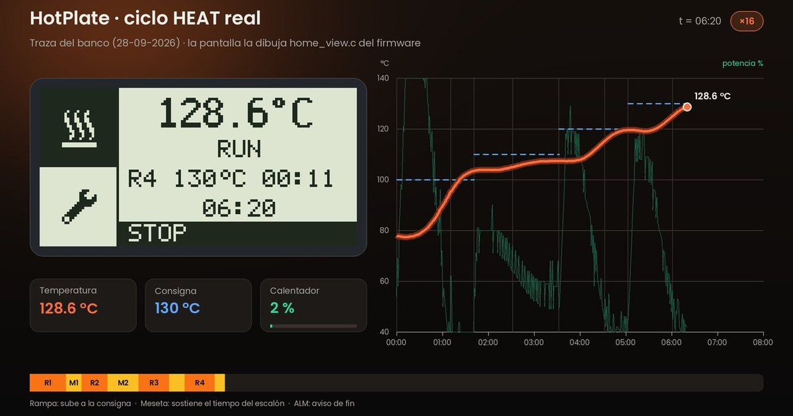

<a href="https://krisskira.github.io/smd-soldering-hotplate/">
  
</a>

# HotPlate

Estación abierta de soldadura SMD por reflow. En lugar de calentar a ojo, ejecuta un **Soldering Profile**: una curva de temperatura precisa, etapa a etapa. Sube con control, sostiene cada meseta el tiempo justo, avisa al terminar y se enfría sola.

[Sitio](https://krisskira.github.io/smd-soldering-hotplate/) · [HotPanel y Studio](#dos-formas-de-usarlo) · [Docs](docs/README.md) · [Correo](mailto:krisskira@gmail.com) · [Read in English](README.md)

## Qué hace

- **HEAT** recorre el perfil completo con un gesto: espera opcional, precalentamiento, hasta cuatro escalones que solo suben o se sostienen, y luego enfriamiento.
- **Inicio programado** espera desde 00:00 (inmediato) hasta 12:00 antes de arrancar el ciclo.
- **PI predictivo** corta la potencia antes del objetivo, para que la inercia de la placa no se pase de temperatura.
- **Autoajuste**, lanzado desde HotPlate Studio, aprende cómo responde la placa y guarda las ganancias.
- **Seguridad**: el calentador arranca apagado. Si el sensor falla o la lectura supera `temp_max_c`, la salida se corta al instante.

## Dos formas de usarlo

- **HotPanel**, la interfaz a bordo: temperatura en grande, dos casillas y una perilla. Gira para elegir, pulsa para confirmar. Heat inicia o detiene el ciclo. Ajustes edita las cuatro etapas y el reloj de espera.
- **HotPlate Studio**, la app de escritorio por USB: gráfica de temperatura en vivo, edición del perfil, exportación a CSV, autoajuste y los límites que el panel no muestra. Cuando Studio toma el mando, HotPanel muestra **USB** y el control local se bloquea. Los dos modos no conviven.

## Qué hay en el repositorio

- [`firmware/avr/`](firmware/avr/) — firmware del ATmega16 a 8 MHz. El mapa de documentación y código empieza en [características](firmware/avr/doc/product_features.md), [flujos](firmware/avr/doc/program_flows.md) y [arquitectura](firmware/avr/doc/architecture.md).
- [`host-ui/`](host-ui/) — HotPlate Studio (Python).
- [`hardware/`](hardware/) — PCB en KiCad y hojas de datos.
- [`mechanical/`](mechanical/) — carcasa, tapas y perilla en 3D.
- [`landing-page/`](landing-page/) — el sitio público, React y TypeScript con Vite.

La flash son 16 KB. Mandan el control térmico, la seguridad y la UI aprobada. Ver el [presupuesto de memoria](firmware/avr/doc/feature_budget.md).

## Compilar

```bash
cd firmware/avr && make clean && make && make size && make usb-host-test

cd host-ui && pip install -r requirements.txt && python app.py

cd landing-page && npm install && npm run dev
```

El sitio se publica en GitHub Pages con `.github/workflows/pages.yml` en cada push a `main` que toque `landing-page/`. En el repositorio: **Settings → Pages → Source: GitHub Actions**.

## Licencia

Hardware y software abiertos. Úsalo, estúdialo, modifícalo y compártelo bajo tu responsabilidad. Trabaja con red eléctrica y temperaturas altas.

| Qué | Licencia |
|-----|----------|
| Firmware y HotPlate Studio | [MIT](LICENSE) |
| Placa y modelos 3D | [CERN-OHL-P-2.0](LICENSE) |
| Documentación e iconos | [CC BY 4.0](LICENSE) |

El texto completo está en [LICENSE](LICENSE).

Autor: **Crhistian David Vergara Gómez** · **krisskira@gmail.com**
