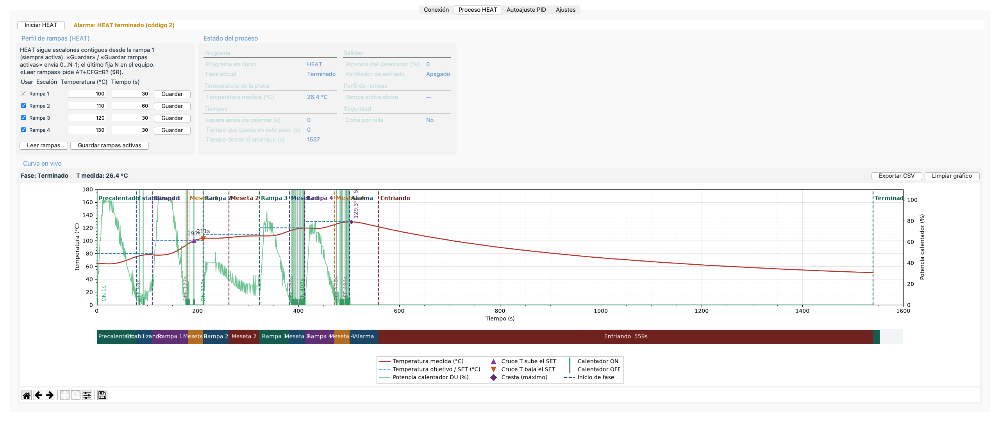

# SMI Soldering Hot Plate

**HotPlate** es la estación de soldadura SMD por reflow de SMI. En lugar de calentar “a ojo”, ejecuta un **Soldering Profile**: una curva de temperatura precisa, etapa a etapa — sube con control, sostiene cada meseta el tiempo justo y se apaga sola al terminar. Así la pasta de soldadura se funde limpia, sin castigar componentes ni PCB.

Se puede usar de dos formas:

- **Desde HotPanel**, la interfaz a bordo de HotPlate: clara, directa, al alcance de la mano.
- **Desde el computador**, con **HotPlate Studio**, para controlarlo, ver gráficas en tiempo real y esculpir cada detalle del Soldering Profile.



> Este documento explica **qué hace** el producto en lenguaje sencillo. Cada sección enlaza a la documentación técnica en [`docs/`](docs/README.md) y [`firmware/avr/doc/`](firmware/avr/doc/) para quien quiera profundizar.

---

## Resumen de características

| Característica | Qué significa para el usuario | Más detalle |
|----------------|-------------------------------|-------------|
| **Ciclo HEAT** | Con un solo gesto, HotPlate ejecuta el Soldering Profile completo: espera (si se programó), precalienta, recorre las etapas, avisa al terminar y se enfría. | [Flujos del programa](firmware/avr/doc/program_flows.md) |
| **Inicio programado** | Espera antes de arrancar, en reloj de horas y minutos, de 00:00 (inmediato) hasta 12:00. | [Características del producto](firmware/avr/doc/product_features.md) |
| **Precalentamiento** | Antes del perfil pleno, HotPlate sube a una temperatura intermedia y se estabiliza, para repartir el calor de forma pareja por toda la placa. | [Características del producto](firmware/avr/doc/product_features.md) |
| **Etapas del Soldering Profile** | Hasta 4 escalones, cada uno con temperatura y tiempo de permanencia. Solo ascienden o se sostienen: nunca bajan a mitad de perfil. | [Flujos del programa](firmware/avr/doc/program_flows.md) |
| **Control térmico preciso** | HotPlate anticipa su propia inercia y corta potencia antes del objetivo, evitando sobrepasar la temperatura. | [Control PI y autoajuste](firmware/avr/doc/pid_control.md) |
| **Autoajuste** | HotPlate puede aprender cómo responde al calor y calcular los valores óptimos de control. Se lanza desde HotPlate Studio. | [Control PI y autoajuste](firmware/avr/doc/pid_control.md) |
| **Seguridad** | Límites mínimo y máximo. Si el sensor falla o se supera el máximo, HotPlate corta la calefacción al instante. Arranca siempre apagado. | [Flujos del programa](firmware/avr/doc/program_flows.md) |
| **Avisos sonoros** | Pitidos al terminar el proceso o ante un fallo. | [Flujos del programa](firmware/avr/doc/program_flows.md) |
| **Enfriamiento asistido** | Opcionalmente activa un ventilador al final para bajar más rápido. | [Características del producto](firmware/avr/doc/product_features.md) |

---

## HotPanel — la interfaz de HotPlate

**HotPanel** es la cara de HotPlate: temperatura en grande, dos casillas y un mando al alcance. Gira para elegir, pulsa para confirmar.

- **Heat**: inicia o detiene el ciclo. Muestra la temperatura, la fase, la rampa en curso (con `°C`) y cuánto tiempo lleva el programa.
- **Ajustes**: edita las temperaturas de las 4 etapas y el reloj de espera (horas y minutos, hasta 12:00).

Cuando HotPlate Studio toma el mando, HotPanel lo indica con **USB** y el control local queda bloqueado: nunca hay dos mandos a la vez.

El diseño de HotPanel (tipografía, textos y disposición) es parte aprobada del producto. Detalle: [guía de estilo](firmware/avr/doc/ui_style_guide.md).

---

## HotPlate Studio — control y personalización

**HotPlate Studio** es la aplicación de escritorio que se conecta a HotPlate por USB. Es la forma más completa de usarlo: todo lo que HotPanel no expone, se define aquí.

| Pestaña | Para qué sirve |
|---------|----------------|
| **Conexión** | Elegir el puerto USB, enlazar con HotPlate y pasarlo a modo controlado por computador. Incluye consola de comunicación. |
| **Proceso HEAT** | Iniciar o detener el ciclo, ver en vivo la **gráfica de temperatura** (objetivo vs. real, por fases) y editar el **Soldering Profile**. Los registros se exportan a **CSV**. |
| **Autoajuste PID** | Lanzar el aprendizaje de HotPlate, seguir el progreso y guardar en el equipo los valores obtenidos. |
| **Ajustes** | Límites térmicos, precalentamiento, arranque y cierre del ciclo, ganancias de control, y la **apariencia de Studio** (fuentes, colores de gráficas, tema). |

Todo se guarda en la memoria interna de HotPlate: sobrevive a desconexiones y apagados.

Ejemplos reales: [`docs/heat-results/`](docs/heat-results/) · [`docs/atune-results/`](docs/atune-results/).

Detalle técnico: [estructura de la app](host-ui/ARCHITECTURE.md) · [protocolo USB](firmware/avr/doc/usb-automation.md).

---

## Qué se puede personalizar

Desde **HotPlate Studio** (y en parte desde **HotPanel**):

- Temperaturas mínima y máxima permitidas.
- Precalentamiento on/off y porcentaje respecto a la primera etapa.
- Tiempo y bandas de tolerancia para considerar la temperatura “estable”.
- Espera antes de iniciar, de 00:00 a 12:00 (horas y minutos).
- Ventilador de enfriamiento al final.
- Ganancias del control y parámetros de autoajuste.

Desde **HotPanel** solo se editan las 4 etapas del Soldering Profile y el reloj de espera — interfaz lista para su uso.

---

## Cómo funciona por dentro (visión general)

El cerebro de HotPlate es un microcontrolador que, a la vez, lee el sensor, decide la potencia, avanza por el Soldering Profile, refresca HotPanel y atiende al computador. Para que ninguna tarea frene a las demás, el firmware se apoya en dos piezas:

| Pieza | Explicación sencilla | Detalle técnico |
|-------|----------------------|-----------------|
| **Planificador de tareas** | Reparte el tiempo en turnos muy cortos; todas las tareas parecen ocurrir a la vez. Por eso HotPanel responde aunque HotPlate esté calentando. | [Arquitectura](firmware/avr/doc/architecture.md) · [Temporización no bloqueante](firmware/avr/doc/temporizacion_no_bloqueante.md) |
| **Estado central y memoria** | Temperaturas, etapas y ajustes viven en un único lugar. HotPanel, control y Studio leen y escriben ahí. Los ajustes persisten en memoria no volátil. | [Arquitectura](firmware/avr/doc/architecture.md) · [Flujos](firmware/avr/doc/program_flows.md) |

La memoria de programa es limitada (16 KB): cada función se mide y se prioriza. Control térmico, seguridad y UI aprobada mandan. Ver [presupuesto de memoria](firmware/avr/doc/feature_budget.md).

### Componentes principales

| Componente | Función |
|------------|---------|
| Microcontrolador **ATmega16** (8 MHz) | Ejecuta el firmware de HotPlate |
| Sensor **PT100** + **MAX31865** | Mide la temperatura con precisión |
| **MOC3021 + BT136** (SSR) | Conmuta la resistencia calefactora con seguridad |
| Pantalla **ST7920** 128×64 | Temperatura, menú y estado |

Esquemas y hojas de datos: [`hardware/`](hardware/README.md).

---

## Mapa del repositorio

| Carpeta | Contenido |
|---------|-----------|
| [`firmware/avr/`](firmware/avr/) | Firmware que corre dentro de HotPlate |
| [`host-ui/`](host-ui/) | **HotPlate Studio** (Python) |
| [`hardware/`](hardware/) | PCB KiCad y datasheets |
| [`mechanical/`](mechanical/) | Modelos 3D de carcasa, tapas y perilla |
| [`icons/`](icons/) | Iconos originales de la pantalla |
| [`docs/`](docs/) | Índice de documentación y resultados de prueba |
| [`AGENTS.md`](AGENTS.md) | Reglas breves para desarrollo |

## Documentación técnica

| Documento | Qué encontrarás |
|-----------|-----------------|
| [product_features.md](firmware/avr/doc/product_features.md) | Definición del producto, HotPanel y mapa doc↔código |
| [program_flows.md](firmware/avr/doc/program_flows.md) | Fases del ciclo, alarmas y EEPROM (maestro) |
| [architecture.md](firmware/avr/doc/architecture.md) | Organización interna del firmware |
| [temporizacion_no_bloqueante.md](firmware/avr/doc/temporizacion_no_bloqueante.md) | Reloj `avr_delay` · delays sin bloquear HotPanel |
| [usb-automation.md](firmware/avr/doc/usb-automation.md) | Comandos de comunicación con el computador |
| [ui_style_guide.md](firmware/avr/doc/ui_style_guide.md) | Diseño de HotPanel: tipografía e iconos |
| [st7920_pantalla.md](firmware/avr/doc/st7920_pantalla.md) | Bitmaps, diffs y animaciones LCD |
| [pid_control.md](firmware/avr/doc/pid_control.md) | Control de temperatura y autoajuste |
| [feature_budget.md](firmware/avr/doc/feature_budget.md) | Uso de memoria por función |
| [optimization_plan.md](firmware/avr/doc/optimization_plan.md) | Plan de optimización |
| [docs/README.md](docs/README.md) | Índice completo |

## Compilar y ejecutar

```bash
# Firmware de HotPlate (siempre medir el tamaño resultante)
cd firmware/avr && make clean && make && make size && make usb-host-test

# HotPlate Studio
cd host-ui && pip install -r requirements.txt && python app.py
```

---

## Licencia

Hardware y software abiertos. Puedes usar, estudiar, modificar y compartir este proyecto a tu voluntad y bajo tu propia responsabilidad. El autor no se hace responsable del daño, de una implementación inadecuada, del uso fuera del ámbito personal, educativo o de aficionado, ni del mal uso que se le dé.

| Qué | Licencia |
|-----|----------|
| Firmware y HotPlate Studio | [MIT](LICENSE) |
| Placa electrónica y modelos 3D | [CERN-OHL-P-2.0](LICENSE) (hardware abierto, permisiva) |
| Documentación e iconos | [CC BY 4.0](LICENSE) |

El texto completo, el reparto por carpetas y el aviso de seguridad están en [LICENSE](LICENSE).

Autor: **Crhistian David Vergara Gómez**  
Contacto: **krisskira@gmail.com**
