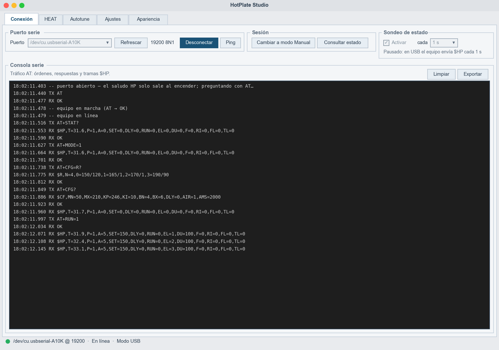
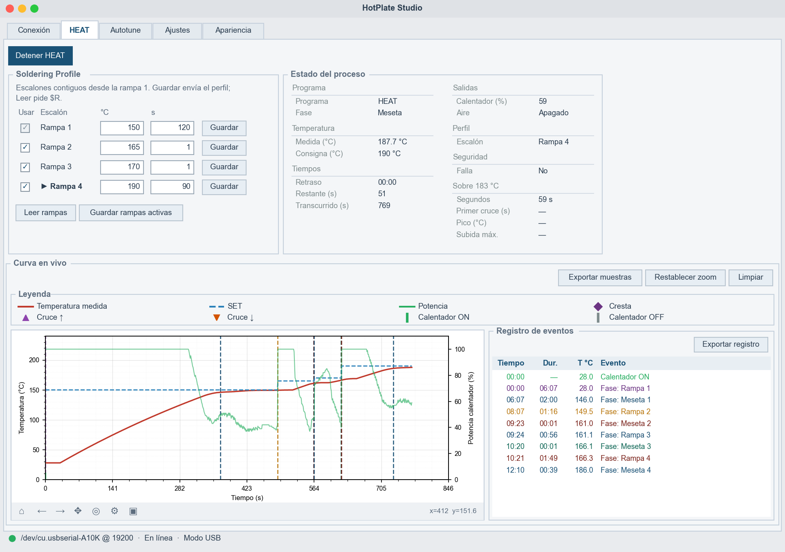
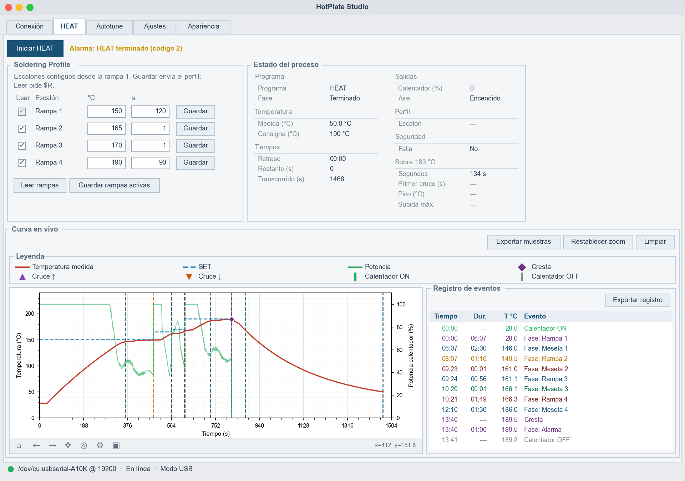
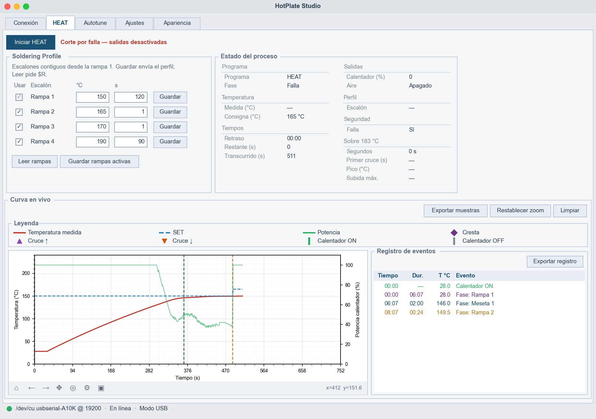
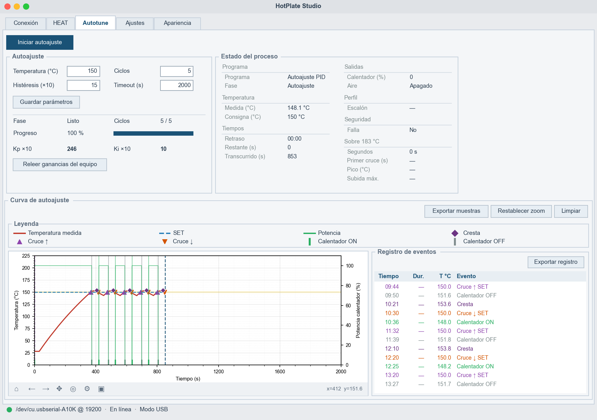
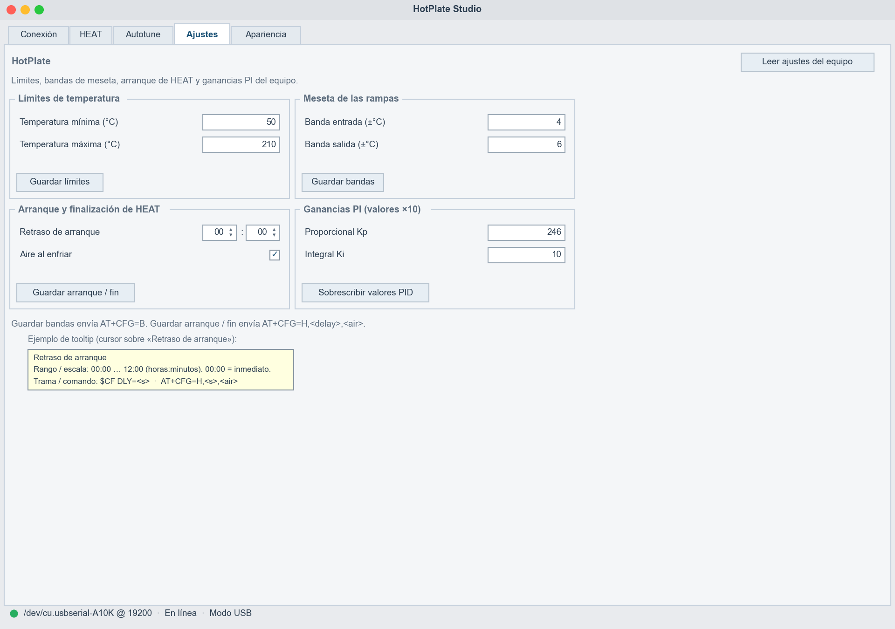
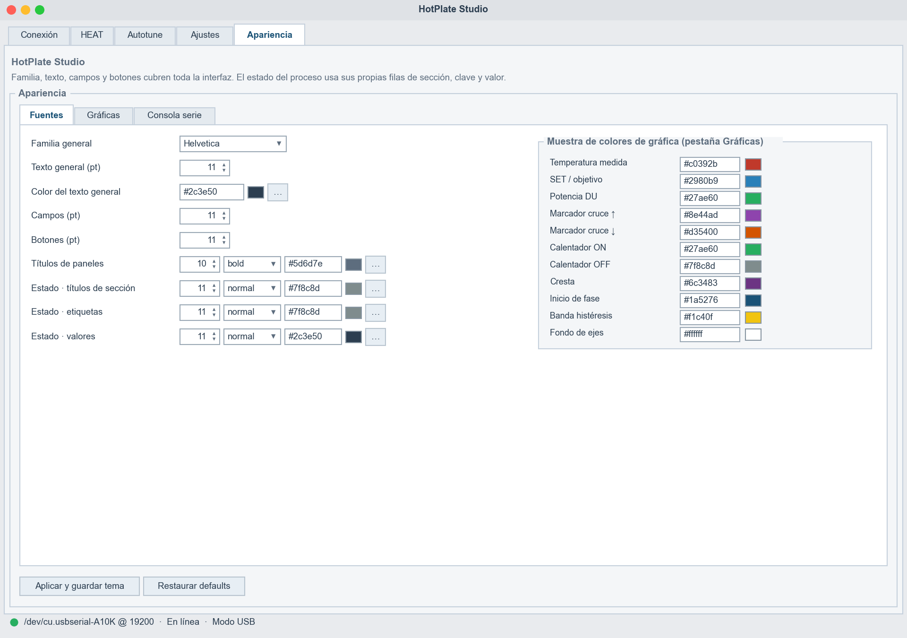

# HotPlate Studio — brief de diseño de interfaz

Paquete para que una IA de diseño de interfaces (Stitch, v0, Figma AI, Galileo, Uizard…) genere la UI de **HotPlate Studio**, la aplicación de escritorio que controla por USB una placa calefactora de soldadura SMD.

| Archivo | Contenido |
|---------|-----------|
| `README.md` | Este documento: prompt, producto, vistas, flujos, datos y tokens |
| `previews/*.png` | Vistas simuladas de la app **tal como está hoy** en `host-ui/`. Se conservan para comparar con el diseño nuevo |
| `stitch/` | Diseño Stitch ya corregido: PNG de referencia y HTML de cada vista. Índice en `stitch/README.md` |
| `tools/render_previews.py` | Genera las vistas previas a partir del código real (textos, colores, fases, detección de eventos). Las curvas salen de un modelo térmico, no de un equipo |

Regenerar las vistas previas:

```bash
python3 hotplate-studio-design/tools/render_previews.py
```

---

## 1. Prompt para la IA de diseño

Copia el bloque tal cual. El resto del documento es el anexo de referencia que el prompt menciona.

```text
Diseña la interfaz de escritorio de "HotPlate Studio", una aplicación de laboratorio que controla
por USB (serie 19200 8N1, protocolo de comandos AT) una placa calefactora para soldar componentes
SMD (reflow). El equipo tiene su propio panel físico (LCD 128×64 + encoder, llamado HotPanel);
Studio es el "modo USB": cuando toma el control, el panel físico solo muestra la temperatura y un
botón EXIT.

Usuario: técnico/maker de electrónica que prepara un perfil de soldadura, lo lanza, observa la curva
en vivo y exporta los datos. Uso en banco de trabajo, sesiones de 10–40 minutos, a veces mirando la
pantalla de lejos. Trabaja con temperaturas reales de hasta 250 °C: la seguridad y el estado del
equipo deben ser inconfundibles.

Plataforma: ventana de escritorio (macOS/Windows/Linux), mínimo 1100×760, por defecto 1280×860.
Idioma de la UI: español. Unidades: °C, segundos, % de potencia, reloj hh:mm para el retraso.

Secciones (hoy son pestañas; puedes proponer navegación lateral si mejora el flujo):
1. Conexión — puerto serie, conectar/desconectar, ping, cambiar entre modo Manual y USB, sondeo de
   estado y consola de tráfico serie (TX/RX con marca de tiempo, exportable).
2. HEAT — el programa de soldadura. Editor del "Soldering Profile" (hasta 4 escalones contiguos:
   temperatura °C + tiempo de meseta s, no decrecientes), botón Iniciar/Detener, panel "Estado del
   proceso", curva en vivo (temperatura, consigna SET, potencia %) con marcadores de eventos y un
   registro de eventos tabular exportable.
3. Autotune — autoajuste PI por relé: parámetros (consigna 120–150 °C, ciclos 3–10, histéresis,
   timeout), progreso por ciclos, ganancias Kp/Ki resultantes, mismo panel de estado y misma curva
   con banda de histéresis.
4. Ajustes — parámetros del equipo guardados en EEPROM: límites de temperatura, bandas de meseta,
   retraso de arranque hh:mm y aire al enfriar, ganancias PI.
5. Apariencia — personalización de tipografías, colores de la gráfica y de la consola.
Además: barra de estado global con LED (rojo desconectado, ámbar esperando respuesta, verde en
línea) + puerto + modo (Manual/USB).

Requisitos clave:
- El estado de enlace y de modo (desconectado / conectado sin respuesta / Manual / USB) debe verse
  desde cualquier sección, y las acciones que exigen modo USB deben verse deshabilitadas o guiar al
  usuario a activarlo.
- Durante HEAT: fase actual (Espera, Rampa n, Meseta n, Alarma, Enfriando, Terminado, Falla),
  temperatura medida grande y legible, consigna, potencia, tiempo restante del paso y transcurrido,
  escalón activo resaltado en el editor del perfil.
- Estados de alarma y falla prominentes (fin de HEAT = aviso ámbar; corte por falla = rojo, "salidas
  desactivadas"; errores del equipo con código y nombre).
- La gráfica es el corazón: eje X desde 0 s que crece con el proceso, eje Y de temperatura, eje Y
  derecho de potencia 0–100 %, marcadores de cruce ↑/↓ del SET, crestas, flancos ON/OFF del
  calentador y líneas de inicio de fase; zoom/pan con "Restablecer zoom"; exportar CSV de muestras y
  de eventos; leyenda fuera del área de trazado.
- Validación en línea de rangos (se listan en el anexo) antes de enviar al equipo.
- Densidad de información alta pero ordenada (herramienta técnica), tema claro por defecto y
  propuesta de tema oscuro. Paleta base: superficie #f4f6f8, texto #2c3e50, acento #1a5276;
  gráfica: temperatura #c0392b, SET #2980b9 (discontinua), potencia #27ae60.

Entregables: pantallas de cada sección en sus estados principales (desconectado, en línea Manual,
USB en reposo, HEAT en curso, HEAT terminado con alarma, falla, autotune en curso y listo), la barra
de estado, los diálogos de confirmación/error, y una hoja de componentes (botones, campos numéricos
con unidad, reloj hh:mm, tarjetas de estado, chips de fase, tabla de eventos, leyenda).

Usa el anexo "HotPlate Studio — brief de diseño de interfaz" como fuente de verdad para textos,
campos, rangos, fases y flujos. Las capturas de previews/ muestran la versión actual para
referencia: mejora la jerarquía y el flujo, pero no elimines funciones.
```

---

## 2. Qué es HotPlate Studio

HotPlate es una placa calefactora (banco PTC controlado con triac, sensor PT100) gobernada por un ATmega16. Tiene dos formas de uso que **nunca** mandan a la vez:

```text
 ┌──────────────────────┐        USB / UART 19200 8N1         ┌──────────────────────────┐
 │  HotPanel (equipo)   │ ◄─────────────────────────────────► │   HotPlate Studio (PC)   │
 │  LCD 128×64+encoder  │   AT+...  →  comandos               │   Python / Tk + mpl       │
 │  Modo MANUAL         │   ← OK / ERROR:n / ALARM:n          │   Modo USB                │
 │                      │   ← $HP (estado, 1 Hz en USB)       │                           │
 │  En modo USB muestra │   ← $CF (ajustes)  ← $R (perfil)    │   Perfil, curva, ajustes, │
 │  solo T + "USB" +    │                                     │   autotune, exportación   │
 │  botón EXIT          │                                     │                           │
 └──────────────────────┘                                     └──────────────────────────┘
```

| Concepto | Qué significa para la UI |
|----------|--------------------------|
| **HEAT** | Único programa de soldadura. Recorre el *Soldering Profile* desde la rampa 1. Tiene retraso opcional (hh:mm) |
| **Soldering Profile** | 1 a 4 escalones contiguos. Cada uno: temperatura objetivo (°C) y meseta (s). No puede bajar de un escalón al siguiente |
| **Rampa / Meseta** | Cada escalón tiene una subida hacia el SET (fase *Rampa*) y un mantenimiento (*Meseta*) que empieza al entrar en la banda ±BN °C |
| **PID_TUNE (Autotune)** | Ensayo de oscilación por relé que calcula Kp/Ki y los guarda solo en EEPROM al terminar |
| **Modo USB** | Studio toma el control (`AT+MODE=1`). Sin él, el equipo rechaza `RUN`, `STOP` y `CFG` con `ERROR:3` |
| **Límites** | `Tmin` (fin del enfriamiento) y `Tmax` (corte de seguridad). La consigna nunca pasa de **250 °C** ni de `Tmax` |

Stack actual: Python 3 + Tkinter/ttk (tema `clam`) + Matplotlib embebido. Código en `host-ui/`; contrato serie en `firmware/avr/doc/usb-automation.md`.

---

## 3. Arquitectura de información

```text
HotPlate Studio  (ventana 1280×860, mínimo 1100×760)
│
├── [Conexión]    Puerto serie · Sesión · Sondeo de estado · Consola serie
├── [HEAT]        Iniciar/Detener + banner · Soldering Profile · Estado del proceso · Curva en vivo
├── [Autotune]    Iniciar/Detener + banner · Autoajuste (params + progreso + Kp/Ki) · Estado · Curva
├── [Ajustes]     Límites · Meseta de las rampas · Arranque y fin de HEAT · Ganancias PI
├── [Apariencia]  Fuentes · Gráficas · Consola serie  (sub-pestañas)
│
└── Barra de estado (siempre visible): ● LED + "puerto @ 19200 · En línea · Modo USB"
```

Componentes compartidos:

- **Estado del proceso** (`views/status_panel.py`): el mismo panel en HEAT y Autotune.
- **Curva + Registro de eventos** (`chart.py`): el mismo componente en HEAT y Autotune.
- **Tooltips**: cada campo de Ajustes/Autotune y cada fila del estado explica rango y trama AT.

### Estados globales de la sesión

```text
            Conectar                 AT → OK  (o saludo "HP")
 ┌─────────────┐     ┌──────────────────────┐     ┌────────────────────────┐
 │ DESCONECTADO│ ──► │ CONECTADO, SIN RESP. │ ──► │ EN LÍNEA · MODO MANUAL │
 │  LED rojo   │     │  LED ámbar           │     │  LED verde             │
 │  sin texto  │     │ "Preguntando al      │     │  sondeo AT+STAT? cada  │
 └─────────────┘     │  equipo…"            │     │  1 s…5 min (opcional)  │
        ▲            └──────────────────────┘     └───────────┬────────────┘
        │  Desconectar / cable fuera                AT+MODE=1 │ ▲ AT+MODE=0
        │                                                     ▼ │ ERROR:8 (EXIT en HotPanel)
        │                                         ┌────────────────────────┐ o saludo HP (reinicio)
        └──────────────────────────────────────── │ EN LÍNEA · MODO USB    │
                                                  │  LED verde             │
                                                  │  $HP llega solo a 1 Hz │
                                                  │  lee $R y $CF al entrar│
                                                  └────────────────────────┘
```

---

## 4. Vistas

Cada vista incluye propósito, wireframe ASCII del diseño actual, inventario de controles con su comando AT y la vista previa simulada.

### 4.1 Conexión

**Qué es:** el punto de entrada. Abre el puerto serie, confirma que el equipo responde, cambia de modo y muestra todo el tráfico.

**Qué hace:**

- Lista puertos serie (`Refrescar`), abre/cierra (`Conectar` ↔ `Desconectar`, botón de acento).
- Al abrir envía `AT`; con `OK` marca "en línea". `Ping` reenvía `AT` (solo visible conectado).
- `Cambiar a modo USB` / `Cambiar a modo Manual` → `AT+MODE=1` / `AT+MODE=0`. Al entrar en USB lee el perfil (`AT+CFG=R?`) y los ajustes (`AT+CFG?`).
- `Consultar estado` → `AT+STAT?` (funciona en ambos modos).
- **Sondeo de estado:** en Manual consulta `AT+STAT?` cada 1 s…5 min. En USB se pausa ("Pausado: en USB el equipo envía $HP cada 1 s"). Durante HEAT queda forzado a 1 s y bloqueado.
- **Consola serie:** líneas `hh:mm:ss.mmm DIR texto` con `DIR` = `TX`, `RX`, `--` (evento local) o `!!` (error/timeout). `Limpiar` y `Exportar` (.log/.txt).

```text
┌ Puerto serie ─────────────────────────────────────────────────┐┌ Sesión ─────────────────────────────┐┌ Sondeo de estado ─────────┐
│ Puerto [/dev/cu.usbserial-A10K ▾] [Refrescar] 19200 8N1       ││ [Cambiar a modo USB] [Consultar     ││ [✓] Activar  cada [1 s ▾] │
│                                   [■ Conectar ■] [Ping]       ││                       estado]       ││ (nota si está pausado)    │
└───────────────────────────────────────────────────────────────┘└─────────────────────────────────────┘└───────────────────────────┘
┌ Consola serie ───────────────────────────────────────────────────────────────────────────────────────────────────────────────┐
│ Tráfico AT: órdenes, respuestas y tramas $HP.                                                         [Limpiar] [Exportar]  │
│ ┌──────────────────────────────────────────────────────────────────────────────────────────────────────────────────────────┐ │
│ │ 18:02:11.403 -- puerto abierto — el saludo HP solo sale al encender; preguntando con AT…      (fondo #1e1e1e, Menlo 11) │ │
│ │ 18:02:11.440 TX AT                                                                                                       │ │
│ │ 18:02:11.477 RX OK                                                                                                       │ │
│ │ 18:02:11.627 TX AT+MODE=1                                                                                                │ │
│ │ 18:02:11.664 RX $HP,T=31.6,P=1,A=0,SET=0,DLY=0,RUN=0,EL=0,DU=0,F=0,RI=0,FL=0,TL=0                                        │ │
│ │ …                                                                                                                        │ │
│ └──────────────────────────────────────────────────────────────────────────────────────────────────────────────────────────┘ │
└──────────────────────────────────────────────────────────────────────────────────────────────────────────────────────────────┘
● /dev/cu.usbserial-A10K @ 19200  ·  En línea  ·  Modo USB
```

| Control | Estado habilitado | Acción |
|---------|-------------------|--------|
| Combo Puerto | Solo desconectado | Elige puerto |
| Refrescar | Siempre | Relista puertos |
| Conectar / Desconectar | Siempre | Abre/cierra + `AT` |
| Ping | Visible si conectado; activo si en línea | `AT` |
| Cambiar a modo USB/Manual | En línea | `AT+MODE=1/0` |
| Consultar estado | En línea | `AT+STAT?` |
| Activar sondeo + intervalo | Manual y no en HEAT | Programa `AT+STAT?` |



---

### 4.2 HEAT

**Qué es:** la pantalla de trabajo. Se edita el perfil, se lanza el ciclo y se sigue en vivo.

**Qué hace:**

- **Iniciar HEAT** (acento) valida el perfil local (escalones no decrecientes), limpia la curva, fija el sondeo a 1 s y envía `AT+RUN=1`. El equipo corre **el perfil guardado en su EEPROM**. Mientras corre, el botón pasa a **Detener HEAT** (`AT+STOP`, que cierra el ciclo como fin → alarma).
- **Banner** a la derecha del botón: `Alarma: HEAT terminado (código 2)` (ámbar), `Error: <nombre> (código n)` (rojo), `Corte por falla — salidas desactivadas` (rojo).
- **Soldering Profile:** 4 filas `[Usar] Rampa n  [°C] [s] [Guardar]`. La rampa 1 siempre está activa (casilla deshabilitada). Desactivar una rampa desactiva las siguientes (prefijo contiguo). `Guardar` por fila y `Guardar rampas activas` envían el perfil completo (`AT+CFG=R,i,°C,s` por escalón, luego relee con `AT+CFG=R?`). `Leer rampas` pide `$R`. Durante Rampa/Meseta la fila activa se muestra como **► Rampa n** en negrita. Los cambios se guardan también en `host-ui/ramps.json`.
- **Estado del proceso:** ver [4.6](#46-componente-estado-del-proceso).
- **Curva en vivo:** ver [4.7](#47-componente-curva--registro-de-eventos). Eje X planificado = Σ mesetas + 90 s por escalón + 180 s (mín. 300 s, máx. 7200 s); crece si el proceso lo supera. Eje Y = máx(°C activos) + 50 °C. SET solo se dibuja en Rampa/Meseta.

```text
[■ Iniciar HEAT ■]  Alarma: HEAT terminado (código 2)                     ← banner de color según severidad
┌ Soldering Profile ─────────────────────────────┐┌ Estado del proceso ─────────────────────────────────────────┐
│ Escalones contiguos desde la rampa 1. Guardar  ││ Programa                    Salidas                         │
│ envía el perfil; Leer pide $R.                 ││  Programa      HEAT          Calentador (%)   90            │
│ Usar  Escalón      °C       s                  ││  Fase          Meseta        Aire             Apagado       │
│ [✓]   Rampa 1     [150]   [120]  [Guardar]     ││ Temperatura                 Perfil                          │
│ [✓]   Rampa 2     [165]   [  1]  [Guardar]     ││  Medida (°C)   188.1 °C      Escalón          Rampa 4       │
│ [✓]   Rampa 3     [170]   [  1]  [Guardar]     ││  Consigna (°C) 190 °C       Seguridad                       │
│ [✓] ► Rampa 4     [190]   [ 90]  [Guardar]     ││ Tiempos                      Falla            No            │
│                                                ││  Retraso       00:00        Sobre 183 °C                    │
│ [Leer rampas] [Guardar rampas activas]         ││  Restante (s)  51            Segundos         69 s          │
│                                                ││  Transcurrido  680           Primer cruce (s) —             │
│                                                ││                              Pico (°C)        —             │
│                                                ││                              Subida máx.      —             │
└────────────────────────────────────────────────┘└─────────────────────────────────────────────────────────────┘
┌ Curva en vivo ─────────────────────────────────────────────────────────────────────────────────────────────────┐
│                                                        [Exportar muestras] [Restablecer zoom] [Limpiar]        │
│ ┌ Leyenda ───────────────────────────────────────────────────────────────────────────────────────────────────┐ │
│ │ ── Temperatura medida    - - SET          ── Potencia         ◆ Cresta                                     │ │
│ │ ▲ Cruce ↑                ▼ Cruce ↓        | Calentador ON     | Calentador OFF                             │ │
│ └────────────────────────────────────────────────────────────────────────────────────────────────────────────┘ │
│ ┌──────────────────────────────────────────────────────────────┐┌ Registro de eventos ──────────────────────────┐ │
│ │ °C                                                     %     ││                          [Exportar registro]  │ │
│ │ 200┤                              ┊      ╭────◆         ┤100 ││ Tiempo  Dur.   T °C   Evento                  │ │
│ │    │                       ┊ ╭───┊──────╯                │    ││ 00:00    —     28.0   Calentador ON           │ │
│ │ 150┤ - - - - - - - -▲▼▲────╯ - -┊- - - - -              ┤ 50 ││ 00:00  06:07   28.0   Fase: Rampa 1           │ │
│ │    │           ╭──╯        ┊    ┊                        │    ││ 06:07  02:00  146.0   Fase: Meseta 1          │ │
│ │  50┤     ╭────╯            ┊    ┊                        │    ││ 08:07  01:16  149.5   Fase: Rampa 2           │ │
│ │   0┼─────┴────┴────┴────┴──┴────┴────┴────┴──────────────┤  0 ││ …  (colores por tipo de evento/fase)         │ │
│ │     0   94  188  282  376  470  564  658  752  Tiempo (s)    ││                                               │ │
│ │ [⌂][←][→][✥][◎][⚙][▣]                         x=412 y=151.6  ││                                               │ │
│ └──────────────────────────────────────────────────────────────┘└───────────────────────────────────────────────┘ │
└────────────────────────────────────────────────────────────────────────────────────────────────────────────────┘
```

Estados de la vista HEAT:

| Estado | Botón | Banner | Fila perfil | Curva |
|--------|-------|--------|-------------|-------|
| Reposo (IDLE) | Iniciar HEAT | vacío | sin resaltar | vacía o último ciclo |
| En curso (Espera/Rampa/Meseta/Alarma/Enfriando) | Detener HEAT | vacío o alarma | ► escalón activo en Rampa/Meseta | grabando a 1 Hz |
| Terminado | Iniciar HEAT | ámbar "Alarma: HEAT terminado (código 2)" | sin resaltar | ciclo completo |
| Falla | Iniciar HEAT | rojo "Corte por falla — salidas desactivadas" | sin resaltar | cortada en el instante del fallo |
| Error de arranque | Iniciar HEAT | rojo "Error: …" + diálogo | — | vacía |







---

### 4.3 Autotune

**Qué es:** asistente de autoajuste PI (método de relé + Ziegler–Nichols PI). Calcula Kp/Ki y el equipo los guarda en EEPROM al terminar.

**Qué hace:**

- **Parámetros** (2×2): Temperatura (°C), Ciclos, Histéresis (×10), Timeout (s). `Guardar parámetros` envía `AT+CFG=T,<ciclos>,<hyst>,<max_s>` y guarda caché local (`tune_params.json`). La temperatura solo se guarda en la caché local: no viaja en `CFG=T`.
- **Iniciar autoajuste** (acento) → `AT+RUN=2,<°C>,<ciclos>,<hyst>,<max_s>`; pasa a **Detener autoajuste** (`AT+STOP`).
- **Progreso:** Fase (`Inactivo` / `En curso` / `Listo` / `Fallido`, campo `AP`), Ciclos `AC / objetivo`, barra de progreso 0–100 %.
- **Resultado:** `Kp ×10` y `Ki ×10` (campos `AK`/`AI` al terminar). Antes del resultado muestran las ganancias vigentes del equipo. `Releer ganancias del equipo` (activo solo con resultado listo) → `AT+CFG?`.
- **Curva de autoajuste:** eje X **fijo** = timeout; eje Y = 1.5 × consigna; banda amarilla = SET ± histéresis. Registra cruces, crestas y flancos ON/OFF de cada ciclo.

```text
[■ Iniciar autoajuste ■]   (banner: "Corte por falla — salidas desactivadas" si FL=1)
┌ Autoajuste ────────────────────────────────────┐┌ Estado del proceso ───────────────────── (igual que HEAT) ┐
│ Temperatura (°C) [ 150]   Ciclos      [   5]   ││ Programa   Autoajuste PID  · Fase  Autoajuste           │
│ Histéresis (×10) [  15]   Timeout (s) [2000]   ││ Medida 148.1 °C · Consigna 150 °C · Transcurrido 853    │
│ [Guardar parámetros]                           ││ …                                                       │
│ ────────────────────────────────────────────── ││                                                         │
│ Fase      Listo          Ciclos    5 / 5       ││                                                         │
│ Progreso  100 %          [██████████████████]  ││                                                         │
│ Kp ×10    246            Ki ×10    10          ││                                                         │
│ [Releer ganancias del equipo]                  ││                                                         │
└────────────────────────────────────────────────┘└─────────────────────────────────────────────────────────┘
┌ Curva de autoajuste ────────────── (mismo componente que HEAT; eje X fijo 0…timeout, banda ± histéresis) ──┐
│ 225┤                                                                                                     │
│ 150┤▒▒▒▒▒▒▒▒▒▒▒▒▒▒▒◆▲▼◆▲▼◆▲▼◆▲▼◆▲▼┊▒▒▒▒▒▒▒▒▒▒▒▒▒▒▒▒▒▒▒▒▒▒▒▒▒▒▒▒▒▒▒▒▒▒▒▒▒▒▒▒▒▒▒▒▒▒▒▒▒▒▒▒▒▒▒▒▒   (banda)  │
│    │        ╭─────╯                    ┊                                                                  │
│  0 ┼──────╯──────────────────────────────┴────────────────────────────────────────────────── 2000 s       │
└───────────────────────────────────────────────────────────────────────────────────────────────────────────┘
```



---

### 4.4 Ajustes

**Qué es:** parámetros persistentes del equipo. Se cargan con `Leer ajustes del equipo` (`AT+CFG?` → `$CF`) y automáticamente al entrar en modo USB. Tiene scroll vertical.

**Qué hace:** cuatro bloques en rejilla 2×2, cada uno con su botón de guardado al pie. Todos los campos tienen tooltip "título · rango / escala · trama / comando".

```text
HotPlate                                                                          [Leer ajustes del equipo]
Límites, bandas de meseta, arranque de HEAT y ganancias PI del equipo.
┌ Límites de temperatura ─────────────────┐┌ Meseta de las rampas ───────────────────┐
│ Temperatura mínima (°C)        [   50]  ││ Banda entrada (±°C)            [    4]  │
│ Temperatura máxima (°C)        [  210]  ││ Banda salida (±°C)             [    6]  │
│ [Guardar límites]                       ││ [Guardar bandas]                        │
└─────────────────────────────────────────┘└─────────────────────────────────────────┘
┌ Arranque y finalización de HEAT ────────┐┌ Ganancias PI (valores ×10) ─────────────┐
│ Retraso de arranque      [00▴▾]:[00▴▾]  ││ Proporcional Kp                [  246]  │
│ Aire al enfriar                    [✓]  ││ Integral Ki                    [   10]  │
│ [Guardar arranque / fin]                ││ [Sobrescribir valores PID]              │
└─────────────────────────────────────────┘└─────────────────────────────────────────┘
Guardar bandas envía AT+CFG=B. Guardar arranque / fin envía AT+CFG=H,<delay>,<air>.
```

| Bloque | Campos | Rango | Comando al guardar | Confirmación |
|--------|--------|-------|--------------------|--------------|
| Límites de temperatura | Mínima, Máxima | min 30…100, max 40…260, min ≤ max | `AT+CFG=S,<min>,<max>` | "Límites de temperatura guardados." |
| Meseta de las rampas | Banda entrada, Banda salida | BN 1…15, BX BN…20 | `AT+CFG=H` y luego `AT+CFG=B,<bn>,<bx>` | "Flujo HEAT y bandas guardados" |
| Arranque y fin de HEAT | Retraso hh:mm, Aire al enfriar | 00:00…12:00 (en 12 h los minutos quedan en 00) | `AT+CFG=H,<s>,<air>` y luego `AT+CFG=B` | ídem |
| Ganancias PI | Kp, Ki (×10) | 0…999 | `AT+CFG=P,<kp>,<ki>` | "Ganancias PID guardadas en el equipo." |

"Guardar bandas" y "Guardar arranque / fin" hoy envían lo mismo: ambos comandos (`H` y `B`) en cadena.



---

### 4.5 Apariencia

**Qué es:** personalización local de la app (no toca el equipo). Se guarda en `host-ui/ui_theme.json`.

**Qué hace:** sub-pestañas y botones `Aplicar y guardar tema` / `Restaurar defaults`.

| Sub-pestaña | Filas |
|-------------|-------|
| Fuentes | Familia general; Texto general (pt); Color del texto; Campos (pt); Botones (pt); Títulos de paneles, Estado · títulos de sección, Estado · etiquetas, Estado · valores (cada uno: tamaño + peso + color) |
| Gráficas | Colores de: Temperatura medida, SET, Potencia DU, Cruce ↑, Cruce ↓, Calentador ON, Calentador OFF, Cresta, Inicio de fase, Banda histéresis, Fondo de ejes |
| Consola serie | Familia, Tamaño, Fondo, Texto, Borde |

Cada color es `[#hex] [■ muestra] […]` (el botón abre el selector de color del sistema).

```text
HotPlate Studio
Familia, texto, campos y botones cubren toda la interfaz. El estado del proceso usa sus propias filas…
┌ Apariencia ──────────────────────────────────────────────────────────────────────────────┐
│ ┌Fuentes┐┌Gráficas┐┌Consola serie┐                                                        │
│ │ Familia general            [Helvetica ▾]                                               │
│ │ Texto general (pt)         [11 ▴▾]                                                     │
│ │ Color del texto general    [#2c3e50] [■] […]                                           │
│ │ Títulos de paneles         [10 ▴▾] [bold ▾] [#5d6d7e] [■] […]                          │
│ │ …                                                                                      │
│ [Aplicar y guardar tema] [Restaurar defaults]                                            │
└──────────────────────────────────────────────────────────────────────────────────────────┘
```



En la vista previa, el panel derecho reúne los colores de la sub-pestaña *Gráficas* para verlos juntos. En la app real están en su propia sub-pestaña.

---

### 4.6 Componente: Estado del proceso

Panel de dos columnas alimentado por cada trama `$HP`. Las etiquetas son cortas; el tooltip de cada fila explica el campo.

| Sección | Etiqueta | Campo `$HP` | Formato |
|---------|----------|-------------|---------|
| Programa | Programa | `P` | `HEAT` / `Autoajuste PID` / — |
| | Fase | `A` | nombre de fase (tabla 6.2) |
| Temperatura | Medida (°C) | `T` | `188.1 °C` o — si `T=---` (sensor inválido) |
| | Consigna (°C) | `SET` | `190 °C` |
| Tiempos | Retraso | `DLY` | `hh:mm`; en reposo/terminado muestra el retraso configurado en Ajustes |
| | Restante (s) | `RUN` | segundos del paso actual |
| | Transcurrido (s) | `EL` | segundos desde el arranque |
| Salidas | Calentador (%) | `DU` | 0…100 |
| | Aire | `F` | Encendido / Apagado |
| Perfil | Escalón | `RI` | `Rampa n` solo en Rampa/Meseta |
| Seguridad | Falla | `FL` | Sí / No |
| Sobre 183 °C | Segundos | `TL` | s con la placa ≥ 183 °C (liquidus SnPb) |
| | Primer cruce (s) | `TC` | hoy siempre — (el firmware ya no lo emite) |
| | Pico (°C) | `PK` | hoy siempre — |
| | Subida máx. | `MS` | hoy siempre — |

### 4.7 Componente: Curva + Registro de eventos

```text
┌ <Título> ─────────────────────────────────────────── [Exportar muestras] [Restablecer zoom] [Limpiar] ┐
│ ┌ Leyenda (2 filas × 4, fuera del trazado) ─────────────────────────────────────────────────────────┐ │
│ └───────────────────────────────────────────────────────────────────────────────────────────────────┘ │
│ ┌ Trazado (≈62 %, redimensionable) ──────────────────┐║┌ Registro de eventos (≈38 %) ────────────────┐ │
│ │ Eje Y izq.: Temperatura (°C), Y der.: Potencia (%) │║│ [Exportar registro]                         │ │
│ │ Series: T (roja, sólida), SET (azul, discontinua), │║│ Tiempo │ Dur. │ T °C │ Evento               │ │
│ │ DU (verde, 65 % opaca, eje derecho)                │║│  mm:ss │mm:ss │ 0.0  │ Fase: Meseta 2       │ │
│ │ Marcadores sin texto encima                        │║│  (máx. 300 filas, auto-scroll al final)     │ │
│ │ Barra de herramientas mpl: inicio/atrás/adelante/  │║│                                             │ │
│ │ pan/zoom/ajustes/guardar + coordenadas del cursor  │║│                                             │ │
│ └────────────────────────────────────────────────────┘║└─────────────────────────────────────────────┘ │
└──────────────────────────────────────────────────────────────────────────────────────────────────────┘
```

| Evento | Marcador en curva | Fila del registro | Color por defecto |
|--------|-------------------|-------------------|-------------------|
| Inicio de fase | Línea vertical discontinua | `Fase: Rampa 2` con duración | color estable por nombre de fase |
| T cruza SET subiendo | ▲ | `Cruce ↑ SET` | #8e44ad |
| T cruza SET bajando | ▼ | `Cruce ↓ SET` | #d35400 |
| Cresta (máximo que luego baja ≥ 5 °C) | ◆ | `Cresta` | #6c3483 |
| Calentador pasa de 0 % a > 0 % | línea vertical + tick | `Calentador ON` | #27ae60 |
| Calentador vuelve a 0 % | línea vertical + tick | `Calentador OFF` | #7f8c8d |

Reglas de ejes: origen X siempre en 0; el eje Y automático solo crece, en saltos de 25 °C; el zoom manual se respeta hasta *Restablecer zoom*. Exportaciones CSV:

- Muestras: `Tiempo (s), Temperatura medida (°C), Temperatura consignada / SET (°C), Potencia calentador (%), Fase del proceso` (historial completo, no solo la ventana).
- Eventos: `Tiempo, Duración, Temperatura (°C), Evento`.

---

## 5. Flujos y procesos

### 5.1 Primer uso: conectar y tomar el control

```text
 Usuario                         Studio                                   HotPlate
   │  elige puerto, Conectar       │                                         │
   │ ─────────────────────────────►│ abre 19200 8N1, LED ámbar               │
   │                               │ ── AT ─────────────────────────────────►│
   │                               │ ◄───────────────────────────── OK ──────│
   │                               │ LED verde "En línea · Modo Manual"      │
   │                               │ (si sondeo activo) ── AT+STAT? cada N s ►│
   │  Cambiar a modo USB           │                                         │
   │ ─────────────────────────────►│ ── AT+MODE=1 ──────────────────────────►│ HotPanel: "USB" + EXIT
   │                               │ ◄──────────────────────── $HP + OK ─────│
   │                               │ ── AT+CFG=R? ─► $R  (rellena perfil)    │
   │                               │ ── AT+CFG?   ─► $CF (rellena Ajustes)   │
   │                               │ ◄─────────────── $HP cada 1 s ──────────│
```

Si el equipo está ocupado (p. ej. HEAT lanzado desde HotPanel) responde `ERROR:4`. Si nadie contesta al `AT`, la consola muestra `!!` con la pista "el firmware y Studio tienen que ir los dos a 19200".

### 5.2 Preparar y guardar el Soldering Profile

```text
 Editar °C / s / Usar ──► Guardar (fila) o Guardar rampas activas
                               │
                     ¿escalones contiguos? ── no ──► diálogo "deben ser contiguos desde la rampa 1"
                               │ sí
                     ¿no decrecientes y en Tmin…min(Tmax,200)? ¿hold 1…3600? ── no ──► diálogo con el error
                               │ sí
                     AT+CFG=R,0,°C,s → OK → AT+CFG=R,1,… → … (en cadena; si uno falla: "perfil incompleto")
                               │
                     guarda ramps.json · diálogo "Soldering Profile guardado (N=n)" · AT+CFG=R? para confirmar
```

### 5.3 Ciclo HEAT (máquina de fases del equipo)

```mermaid
flowchart LR
  start([Iniciar HEAT · AT+RUN=1]) --> dly{¿Retraso > 00:00?}
  dly -- sí --> wait[Espera A=1]
  dly -- no --> ramp
  wait --> ramp[Rampa i A=5<br/>sube hacia SET]
  ramp -- "|T−SET| ≤ BN" --> hold[Meseta i A=4<br/>cuenta hold_s]
  hold -- quedan escalones --> ramp
  hold -- último --> alarm[Alarma A=7<br/>ALARM:2 · aire ON]
  alarm --> cool[Enfriando A=6<br/>aire ON]
  cool -- "T ≤ Tmin" --> done([Terminado A=8])
  ramp -. sensor / sobretemp / consigna inalcanzable .-> fault([Falla A=9])
  hold -. .-> fault
```

```text
 °C
 190 ┤                                  ╭─ Meseta 4 ─╮
 170 ┤                        ╭─R3─M3──╯            │╲   Alarma (ALARM:2)
 150 ┤          ╭── Meseta 1 ─╯ R2 M2               │ ╲
     │        ╱                                     │  ╲  Enfriando (aire)
  50 ┤──────╱─────────────────────────────────────── │───╲──────────── Tmin ──► Terminado
     └──Espera──Rampa 1──────────────────────────────────────────────────────────► t
```

Qué hace Studio durante el ciclo:

1. Antes de enviar: valida el perfil local; si falla, diálogo y no arranca.
2. Limpia curva, bloquea el sondeo a 1 s y cambia el botón a **Detener HEAT**.
3. Graba una muestra por cada `$HP` con `P=1` y fase 1…7 (y la última en 8/9).
4. Al ver `A=8` (Terminado) o `A=9` (Falla) desbloquea el sondeo y vuelve a **Iniciar HEAT**.
5. `ALARM:2` pone el banner ámbar; `ERROR:n` el rojo; `FL=1` el de corte por falla.
6. **Detener HEAT** envía `AT+STOP`: en Espera/Rampa/Meseta el equipo lo trata como fin de ciclo (pasa a Alarma → Enfriando).

### 5.4 Autotune

```text
 Parámetros ─► validar (°C 120…150 y en Tmin…Tmax−10 · ciclos 3…10 · hyst 1…99 · timeout 120…3600)
      │
      ▼
 AT+RUN=2,°C,ciclos,hyst,max_s ──► $HP con A=10, AP=1 (En curso), AC=0…n
      │        relé: calentador 100 % hasta SET+h, 0 % (y aire) hasta SET−h, repetir
      │        barra de progreso = AC / ciclos
      ├──► AP=2 (Listo): AK/AI → Kp/Ki en pantalla (ya están en EEPROM) · "Releer ganancias" habilitado
      └──► AP=3 (Fallido): semiperiodo ON ≥ 3× OFF, subida plana 180 s o timeout → no escribe Kp/Ki
```

### 5.5 Guardar ajustes

`Leer ajustes del equipo` → `$CF` rellena todos los campos. Cada bloque valida localmente, envía su comando y muestra un diálogo de confirmación o `El equipo respondió ERROR: <nombre> (código n)`.

### 5.6 Salidas de modo USB

| Disparador | Qué pasa en Studio |
|------------|--------------------|
| `Cambiar a modo Manual` | `AT+MODE=0` → modo Manual, vuelve el sondeo |
| EXIT en HotPanel | Llega `ERROR:8` ("abortado en el equipo") → banner rojo y modo Manual |
| Reinicio del equipo | Llega el saludo `HP` → modo Manual y "arranque del equipo (HP)" en consola |
| Cable desconectado | Evento de enlace → estado desconectado, LED rojo |

### 5.7 Exportar datos

Desde cada curva: `Exportar muestras` (CSV de todo el ciclo) y `Exportar registro` (CSV de eventos). Desde Conexión: `Exportar` la consola (.log). Nombres por defecto: `hotplate_heat_trace.csv`, `hotplate_heat_eventos.csv`, `hotplate_tune_trace.csv`, `hotplate_tune_eventos.csv`, `hotplate_consola.log`.

---

## 6. Datos y protocolo (referencia para textos y estados)

### 6.1 Tramas que recibe la UI

```text
$HP,T=<°C.d|--->,P=<prog>,A=<fase>,SET=<°C>,DLY=<s>,RUN=<s>,EL=<s>,DU=<0..100>,F=0|1,RI=<i>,FL=0|1,TL=<s>
    [+ ,AP=<0..3>,AC=<ciclos>,AK=<kp×10>,AI=<ki×10>   durante autotune]
$CF,MN=<Tmin>,MX=<Tmax>,KP=<kp>,KI=<ki>,BN=<bn>,BX=<bx>,DLY=<s>,AIR=0|1,AMS=<timeout>
$R,N=<n>,0=<°C>/<s>,1=<°C>/<s>,2=<°C>/<s>,3=<°C>/<s>
OK · ERROR:<n> · ALARM:2 · HP (saludo de arranque)
```

### 6.2 Fases (`A`)

| A | Nombre en UI | Uso |
|--:|--------------|-----|
| 0 | Inactivo | Reposo |
| 1 | Espera (retraso) | Cuenta atrás del retraso hh:mm |
| 4 | Meseta | Mantenimiento del escalón |
| 5 | Rampa | Subida hacia el SET |
| 6 | Enfriando | Aire hasta `Tmin` |
| 7 | Alarma | Aviso de fin (pitidos en el equipo) |
| 8 | Terminado | Fin normal |
| 9 | Falla | Corte, salidas apagadas |
| 10 | Autoajuste | PID_TUNE en curso |

`A=2` (Precalentado) y `A=3` (Estabilizando) están reservados: el firmware ya no los emite.

### 6.3 Errores y alarmas

| Código | Texto en UI | Cuándo |
|-------:|-------------|--------|
| ERROR:1 | comando inválido | Comando desconocido |
| ERROR:2 | parámetro inválido | Fuera de rango, perfil decreciente, sin rampas |
| ERROR:3 | se requiere modo USB | `RUN`/`STOP`/`CFG` en Manual |
| ERROR:4 | equipo ocupado | `MODE=1` con el equipo en uso |
| ERROR:5 | programa en curso | `RUN` con otro ciclo activo |
| ERROR:6 | sensor inválido | `RUN` sin PT100 válido |
| ERROR:7 | sobretemperatura | Corte por `Tmax` |
| ERROR:8 | abortado en el equipo | EXIT en HotPanel |
| ERROR:9 | consigna inalcanzable | 3 min a ≥ 95 % sin subir |
| ALARM:2 | HEAT terminado | Fin del perfil o `AT+STOP` en marcha |

### 6.4 Rangos de validación (espejo del firmware)

| Dato | Rango |
|------|-------|
| Temperatura de escalón | `Tmin` … `min(Tmax, 200)` °C, no decreciente respecto al anterior |
| Meseta (hold) | 1 … 3600 s |
| Escalones activos | 1 … 4, contiguos desde la rampa 1 |
| Tmin / Tmax | 30…100 / 40…260 °C, Tmin ≤ Tmax (por defecto 50 / 210) |
| Banda entrada / salida | 1…15 / entrada…20 °C (por defecto 4 / 6) |
| Retraso | 00:00 … 12:00 |
| Kp, Ki (×10) | 0 … 999 (por defecto 246 / 10) |
| Autotune °C | 120 … 150 y dentro de Tmin … Tmax−10 (por defecto 150) |
| Autotune ciclos / hyst ×10 / timeout | 3…10 / 1…99 / 120…3600 s (por defecto 5 / 15 / 2000) |
| Línea AT | máx. 31 caracteres |

---

## 7. Tokens visuales actuales

| Token | Valor | Uso |
|-------|-------|-----|
| Superficie | `#f4f6f8` | Fondo de ventana y paneles |
| Texto | `#2c3e50` | Cuerpo y valores |
| Texto atenuado | `#5d6d7e` / `#7f8c8d` | Títulos de panel, etiquetas del estado |
| Borde de panel | `#c5d0dc` | LabelFrame |
| Botón | `#e7eef4` (hover `#d7e2ec`, pulsado `#c5d4e2`) | Botones secundarios |
| Acento | `#1a5276` (hover `#154360`, pulsado `#0e3046`) | Acción principal, pestaña activa, cabecera de tabla, barra de progreso |
| Pestaña inactiva | `#e4eaef` | Notebook |
| LED | rojo `#c0392b` · ámbar `#f39c12` · verde `#27ae60` | Barra de estado |
| Banner | ámbar `#cc9900` (alarma) · rojo `#c0392b` (error/falla) | Junto al botón principal |
| Consola | fondo `#1e1e1e`, texto `#d4d4d4`, borde `#34495e`, Menlo 11 | Consola serie |
| Gráfica | T `#c0392b` · SET `#2980b9` · DU `#27ae60` · banda `#f1c40f` (15 %) · fondo `#ffffff` | Curvas |
| Tipografía | Helvetica 11 (cuerpo, campos, botones), títulos de panel 10 bold | Toda la app |

---

## 8. Oportunidades de mejora para el rediseño

Salen de leer el código actual. La IA de diseño puede resolverlas, pero no debe quitar ninguna función.

1. **El modo no se ve donde se actúa.** HEAT, Autotune y Ajustes no indican si se está en modo USB; los botones se pueden pulsar en Manual y el equipo responde `ERROR:3`. Propuesta: chip de modo en la cabecera y acciones deshabilitadas con un atajo "Activar modo USB".
2. **Perfil local frente a perfil del equipo.** `Iniciar HEAT` corre el perfil de la EEPROM, no lo que hay en pantalla si no se guardó. Falta un indicador "cambios sin guardar" (o guardar antes de iniciar).
3. **`Guardar` por fila** guarda el perfil entero. Se puede simplificar a un solo botón con estado sucio.
4. **La temperatura en vivo no destaca.** Hoy es una fila más del panel de estado. Conviene una lectura grande (T, SET, fase, tiempo restante) sobre la curva.
5. **Campos muertos.** `Primer cruce`, `Pico` y `Subida máx.` siempre muestran — porque el firmware ya no emite `TC`/`PK`/`MS`. Se pueden calcular en Studio desde la curva o retirar.
6. **"Guardar bandas" y "Guardar arranque / fin"** hacen lo mismo. Se pueden unificar o separar de verdad.
7. **Espacio horizontal sin usar.** Los paneles superiores miden lo que su contenido, y a 1280 px queda un hueco a la derecha. Una rejilla responsive mejora la lectura.
8. **Sondeo en USB.** Los controles de sondeo solo sirven en Manual; en USB podrían ocultarse en lugar de deshabilitarse.
9. **Banner persistente.** El aviso de alarma no se cierra. Conviene un aviso descartable con hora del evento.
10. **Diálogos modales** para cada guardado. Toasts no bloqueantes con detalle en la consola bastarían.
11. **Temperatura de autotune** solo vive en la caché local (`CFG=T` no la envía). Explicarlo en la UI o marcarlo como "solo para el próximo inicio".
