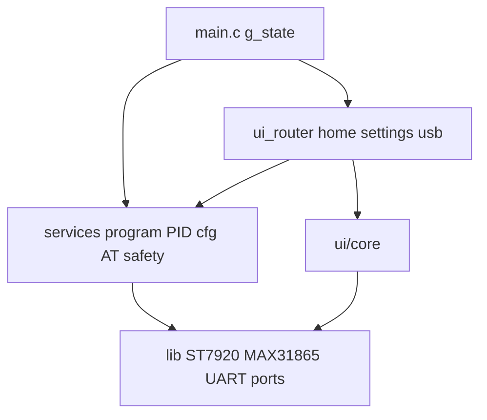
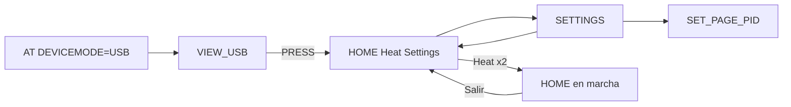
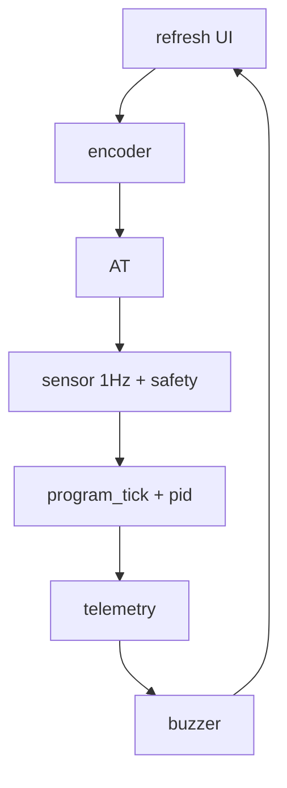

# Arquitectura del firmware AVR

Comportamiento de producto: [product_features.md](product_features.md).  
Flujos de programas (fases, alarmas, rampas): [program_flows.md](program_flows.md).  
UI: [ui_style_guide.md](ui_style_guide.md). AT: [usb-automation.md](usb-automation.md).

Última revisión: 2026-09-27. Un solo binario (`make`). Sin perfiles PANEL/USB.

## Core vs shell

| Capa | Incluye | Regla |
|------|---------|-------|
| **Core** | `program_runner`, `pid`, `pid_atune`, `cfg_store`, `at_cmd`, `app_state`, sensor, safety, outputs, alarmas/beeps | Dueño del comportamiento térmico. En conflicto de flash, el core gana. |
| **Shell** | `home_view`, `settings_view`, `usb_view`, ST7920, fonts, i18n | Adaptador: refleja `app_state_t`. No redefine la secuencia. |

Presupuesto de UI (iconos, animaciones, fuentes grandes): se decide con **`make size`**, no con prohibiciones eternas. Mientras el margen sea mínimo, no se enlazan módulos parked (`features/parked/`).

## Actuador de calor

Banco PTC1+PTC2: GPIO → optoacoplador **MOC3021** → triac **BT136** (SSR). No es un relé mecánico. Ver BOM PCB y [program_flows.md](program_flows.md).

## Árbol

```
firmware/avr/
  src/main.c                 super-loop; g_state
  src/app/                   app_state.h, app_config.h (EEPROM v5)
  src/ui/                    home (Heat|Settings), settings, usb
  src/ui/core/               window, bands, texto
  src/services/program/      máquina de fases (HEAT / PREHEAT / PID_TUNE)
  src/services/pid*.c        lazo + autotune
  src/services/cfg_store.c   EEPROM global + heat/pre/tune + rampas
  src/services/at_cmd.c      AT
  lib/                       drivers + i18n
```

## Capas



## Estado

Una `app_state_t` en `main.c`. Programas lanzables: `HEAT`, `PREHEAT`, `PID_TUNE`. **RAMPS** solo perfil EEPROM.

| Campo clave | Rol |
|-------------|-----|
| `program` / `phase` | Qué corre y en qué etapa |
| `delay_s` | HEAT: 0 = inmediato; >0 = PH_DELAY |
| `ramp_*` | Perfil de escalones |
| `temp_min_c` / `temp_max_c` | Safety + límites de consignas; aire OFF en min |
| `pid_k*` / `atune_*` | Lazo, autoajuste, picos y stream `$HP` a 1 Hz |
| `preheat_en` / `preheat_pct` | HEAT: saltar PREHEAT→STABILIZE, o tope en % de Ramp1 |
| `device_mode` | MANUAL vs USB |

## Navegación



PREHEAT no aparece en Home (solo AT).

## Super-loop



Detalle de fases: [program_flows.md](program_flows.md).

## Seguridad

- Boot: PTC y fan OFF.
- `temp ≥ temp_max_c` (válida) → heaters OFF, UART `OT`, `program_fault`.
- Sensor inválido con programa activo (salvo DELAY/ALARM) → fault.

## Flash

Medir con `make size` tras cada cambio. Gates actuales: `UI_NO_ICONS`, `NO_FONT_6X8` (revisables si hay margen).
