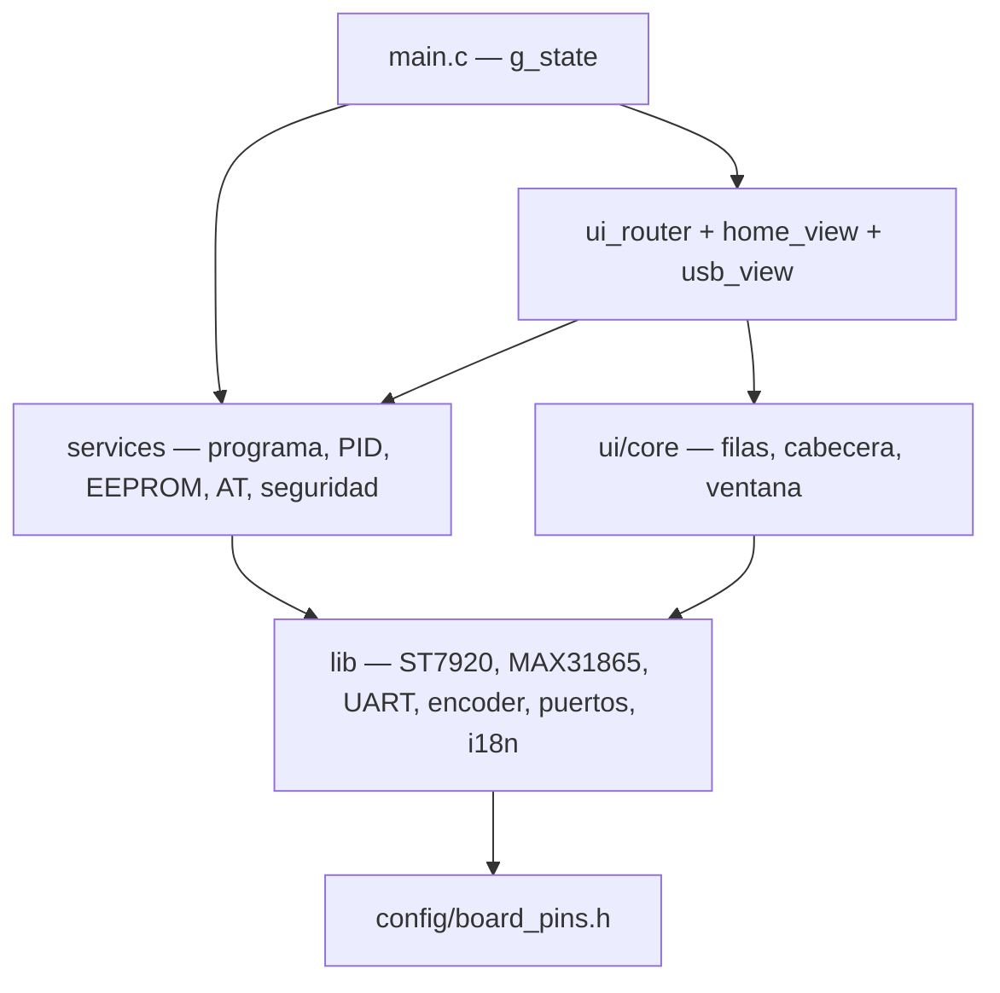
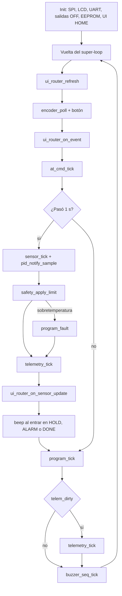
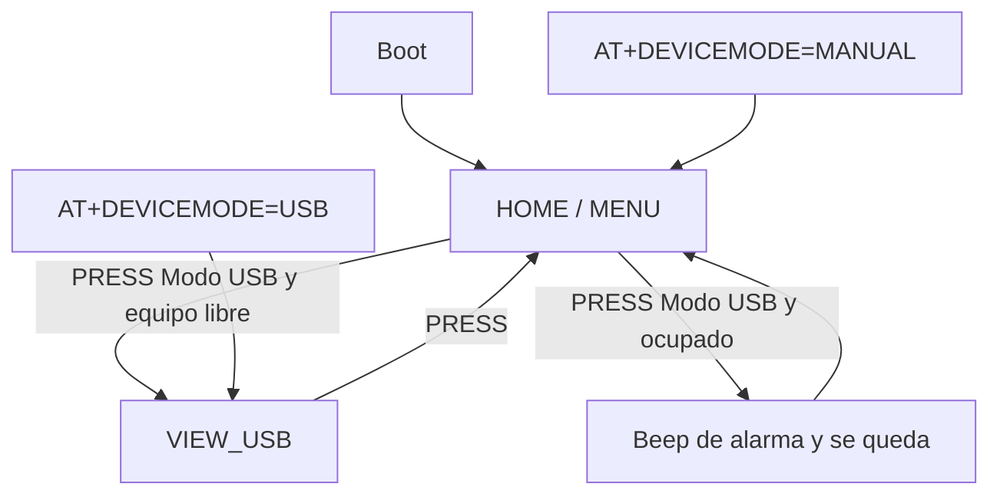
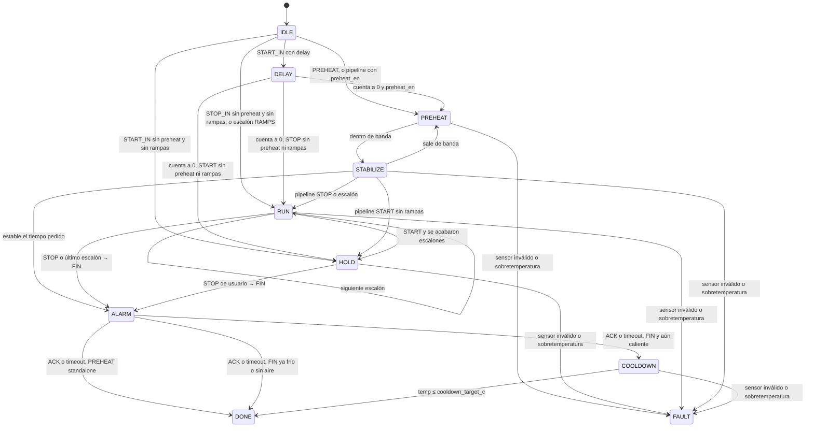

# Arquitectura del firmware AVR

Cómo está armado el firmware y dónde vive cada flujo. El comportamiento de producto está en [product_features.md](product_features.md). El estilo de pantalla, en [ui_style_guide.md](ui_style_guide.md). Los comandos AT, en [usb-automation.md](usb-automation.md).

Última revisión contra el código: 2026-09-26.

Un solo binario (`make`). No hay `PROFILE=PANEL` ni `PROFILE=USB`. Gates en el Makefile: `UI_NO_ICONS` (sin iconos en filas), `NO_FONT_6X8`, `NO_PID_ATUNE`. `pid_atune.c` está en el árbol y no entra al link mientras `NO_PID_ATUNE`.

## Dónde está cada cosa

```
firmware/avr/
  src/main.c                 super-loop; una sola app_state_t
  src/app/app_state.h        vistas, fases, programas, campos de estado
  src/app/app_config.h       límites, índices de menú, EEPROM v3
  src/ui/ui_router.c         despacha HOME o USB
  src/ui/home_view.c         menú HOME (hoy solo Modo USB)
  src/ui/usb_view.c          estado de la sesión USB
  src/ui/core/               window, filas, cabecera, texto (sin pantallas)
  src/services/program/      máquina de fases
  src/services/pid.c         PID por ventana (lo llama program_tick)
  src/services/cfg_store.c   EEPROM global, por programa y rampas
  src/services/at_cmd.c      líneas AT
  src/services/device_session.c   MANUAL ↔ USB
  src/services/telemetry.c   trama $HP
  src/services/sensor_service.c   MAX31865 @ 1 Hz
  src/services/safety.c      corte ≥ 200 °C
  src/services/outputs.c     banco PTC + ventilador
  src/services/buzzer_seq.c  beeps no bloqueantes
  lib/                       drivers e i18n (no conocen pantallas)
  config/board_pins.h        pines
```

La UI no llama drivers de pin. Los drivers no dibujan menús. `main.c` es el único dueño de `g_state`.

| Si buscas… | Archivo | Qué hace |
|------------|---------|----------|
| Orden del bucle | `src/main.c` | Refresh, encoder, AT, sensor 1 Hz, `program_tick`, telemetría, buzzer |
| A qué pantalla va un evento | `src/ui/ui_router.c` | `VIEW_HOME` → `home_view_*`; `VIEW_USB` → `usb_view_*` |
| Ítems del menú | `src/ui/home_view.c` | Hoy solo entra a USB |
| Fases PREHEAT / START / STOP | `src/services/program/program_runner.c` | Start, tick de 1 s, STOP, ACK, fallo |
| Calor durante una fase | `src/services/pid.c` | `pid_tick` solo desde `program_tick` |
| Guardar un toggle | `src/services/cfg_store.c` | `cfg_save_global` / `cfg_save_program` / `cfg_save_ramps` |
| Entrar o salir de USB | `src/services/device_session.c` | Rechaza USB si el equipo está ocupado |
| Comando AT | `src/services/at_cmd.c` | Parseo; arranca con `program_start` |

## Capas



## Estado

Una `static app_state_t g_state` en `main.c`. Definición en `src/app/app_state.h`.

| Campo | Valores | Dónde se usa |
|-------|---------|--------------|
| `view` | `VIEW_HOME`, `VIEW_USB` | El router. No hay más vistas. |
| `home_page` | `MENU` | Subpágina de HOME. Marcha y ajustes no están en esta iteración. |
| `program` | `PREHEAT`, `START_IN`, `STOP_IN`, `PID_TUNE` | RAMPS no es un `program_id_t`. |
| `phase` | ver máquina de fases | La pinta RUN y la trama `$HP` (`ACTION`) |
| `device_mode` | `DEVICE_MANUAL`, `DEVICE_USB` | Exclusivos. USB solo con equipo libre. |

Índices de menú y páginas: `src/app/app_config.h` (`HOME_IDX_*`, `HOME_PAGE_*`, `SETTINGS_COUNT`).

## Super-loop

`program_tick` corre en **cada** vuelta. El sensor y el aviso de muestra nueva van a 1 Hz (`TEMP_PERIOD_MS`). El PID no lo llama `main`: `program_tick` llama `pid_tick` solo en fases con calor (`PH_PREHEAT`, `PH_STABILIZE`, `PH_HOLD`, `PH_RUN`, o `PH_ALARM` con hold).



Dentro de `program_tick`, si la fase calienta, `pid_tick` hace dos cosas: calcula el duty si hay muestra nueva (`pid_compute_sample`) y aplica la ventana de 2 s al banco PTC (`pid_window_tick`).

Seguridad, en dos sitios:

- `safety_apply_limit`: temperatura válida ≥ 200 °C → calefactores OFF, `ALARM:OVER-TEMP`, `program_fault`.
- `program_tick`: programa activo con sensor inválido, salvo `PH_DELAY` y `PH_ALARM` → `program_fault`.
- Boot: `ptc_off()`, `fan_off()`, `outputs_set_quiet(1)`.

## Navegación

Solo dos vistas. HOME tiene una página: el menú con **Modo USB**.



`home_view_on_event` solo atiende PRESS en esa fila: `device_session_enter_usb`. El encoder no cambia de ítem mientras `HOME_COUNT` sea 1.

La marcha y los ajustes no se pintan en HOME. Un ciclo lanzado por AT se sigue en la vista USB. `program_stop` y el ACK siguen en el dominio; la pantalla local que los confirmaba vuelve con las vistas siguientes.

Los flujos de cada programa (qué fase sigue a cuál) están en [product_features.md](product_features.md).

## Máquina de fases

La implementa `program_runner.c`. Tokens UART (`ACTION` de `$HP`) en `program_action_token`.



STOP no siempre aborta:

- En `START_IN` o `STOP_IN`, durante `DELAY`, `PREHEAT`, `STABILIZE`, `HOLD` o `RUN`, `program_stop` entra a FIN (`PH_ALARM` sin calor y bomba si `cooldown_air_en`).
- En PREHEAT standalone, en cooldown, o un segundo STOP ya en alarma, apaga todo y pasa a `PH_IDLE`.
- El PRESS de la vista USB es aborto de sesión: para el programa y fuerza salidas OFF.

## Pintado

1. `ui_comp_draw_header` hace `st7920_clear_gdram` solo con `frame_dirty` (cambio de vista o de página HOME).
2. El refresh de lista usa `row_dirty` y `ui_display_refresh_focus`. Con `UI_NO_ICONS` no hay iconos 8×8 en filas.
3. La cabecera actual es 5×7 con negrita sintetizada (`ST7920_TEXT_BOLD`), centrada, sin icono. `FONT_6X8_BOLD` no se linkea.
4. USB: cada zona es una banda propia (`st7920_draw_band`) que se reescribe entera y no toca a las demás. Cabecera y+0–14 a todo el ancho; icono 32×32 en x 0–31, y 16–47; temperatura 8×12 (+ `C` en 5×7) en x 32–127, y 16–33; programa y 34–43; fase y tiempo y 44–53; pie invertido `Salir ↵` y 54–63.
5. La GDRAM se escribe en bloques de 16 px y no se puede leer. Dos zonas no deben compartir bloque horizontal en las mismas filas.

`st7920_render()` no va en el refresh parcial.

## Actuadores

| API | Uso |
|-----|-----|
| `outputs_bank_set` | PTC1 y PTC2 juntos. Es lo que usa el PID. |
| `program_set_output` | Un canal suelto. Solo en reposo; lo rechaza si hay programa o autotune. |
| `fan_on` / `fan_off` | Bomba de aire en FIN y cooldown |

## Flash

Medir con `make size`. Hasta el rediseño de vistas no reintroducir `font6x8`, `font8x12`, `font_icons` ni linkear `pid_atune.c`. El reproductor de animaciones está en `features/parked/` y no se enlaza; la vista de gráfico de autotune puede recuperarlo.

Textos: tabla C en `lib/i18n/i18n.c` (PROGMEM, un buffer de 24 bytes). No van a EEPROM. La configuración ya ocupa 66 bytes de 512; el resto no compensa sacar las cadenas de la imagen del programa.

Fuentes, medidas como objeto suelto (PROGMEM, sin el código que las dibuja):

| Fuente | En el binario | Flash del glifo |
|--------|---------------|-----------------|
| 5×7 (`font5x7_data` + mapa) | Sí. Menús, fase y temperatura USB | 355 B de glifos + 72 B de mapa (71 caracteres: letras, dígitos, espacio, `*+.|~`, `-`, `:`, `°`) |
| 6×8 negrita | No (`NO_FONT_6X8`) | 414 B de glifos + mapa. Sin `:` |
| 8×12 | Sí. Temperatura de la vista USB | 156 B (`-.0123456789°`, 13 × 12) |
| Iconos 8×8 | Sí, solo `ICO_ENTER` en el pie USB. `UI_NO_ICONS` solo apaga iconos en filas de lista | 8 B |

No recortar: límite 200 °C, OFF al boot, banco PTC unificado, sensor inválido → OFF en programa activo.
