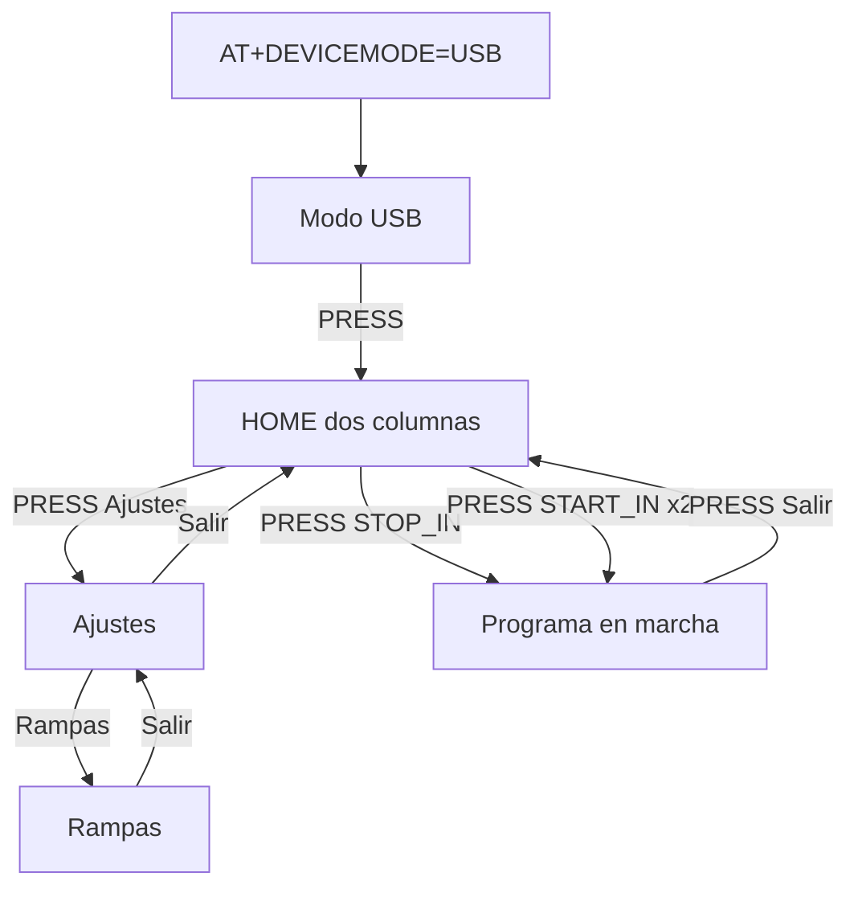
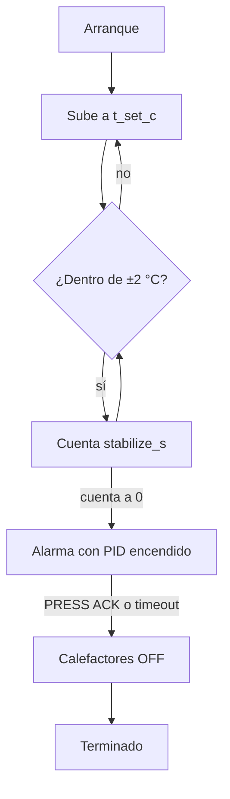
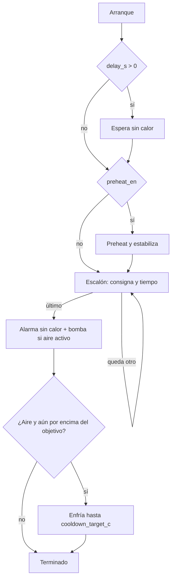
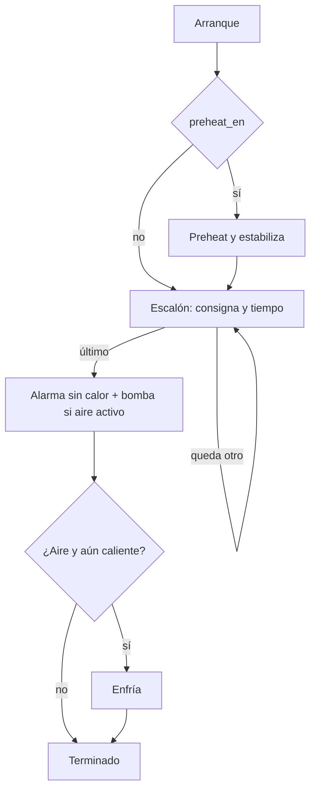

# Características del producto — SMI Soldering Hot Plate

Especificación de comportamiento. Dónde vive cada pieza en el firmware: [architecture.md](architecture.md). Comandos: [usb-automation.md](usb-automation.md).

Firmware: `firmware/avr/`. ATmega16 @ 8 MHz.

Última actualización: 2026-09-26.

## Modelo de control

El calor lo regula un **PID por ventana de tiempo** sobre el banco PTC1+PTC2 (los dos juntos). Los programas encadenan fases. **RAMPS no se lanza**: es el perfil de escalones en EEPROM. Va siempre activo en MANUAL y en USB.

| Pieza | Rol |
|-------|-----|
| PID | Sube o mantiene la temperatura de consigna mientras la fase lo pide |
| PREHEAT | Lleva a consigna y espera estable dentro de banda |
| RAMPS | Escalones temperatura/tiempo, siempre, después del preheat. El paso 1 está siempre activo |
| FIN | Alarma de fin y, si `cooldown_air_en`, bomba de aire hasta `cooldown_target_c` |

## Cómo se navega

Hay tres pantallas: **HOME**, **USB** y **Ajustes**. HOME es de dos columnas: barra lateral con STOP_IN, START_IN y Ajustes, y panel derecho con temperatura y contenido contextual. **Modo USB solo por `AT+DEVICEMODE=USB`**.

El encoder horario cambia de casilla (0→1→2). PRESS actúa según la casilla.

| Casilla HOME | PRESS |
|--------------|-------|
| STOP_IN (start) | Arranca `PROG_STOP_IN` si hay rampas; panel: `RAMPA: Paso i-n`, `T.TRAN:` |
| START_IN (reloj) | 1º edita `delay_s` (±1 min); 2º guarda y arranca. Panel: `SET:*[mm:ss]` |
| Ajustes (engranaje) | Abre `VIEW_SETTINGS` |

En marcha: el encoder no cambia de casilla; el pie `Salir ↵` llama a `device_session_safe_stop` (PTC y aire OFF).

### Ajustes

Cabecera, 4 filas 5×7 y pie `Salir ↵`. El cursor termina en el pie. Cada cambio se guarda en EEPROM al momento.

| Fila | PRESS |
|------|-------|
| Rampas | Abre la página RAMPAS |
| Sonido | ON/OFF del beep de navegación (`buzz_nav_en`). La alarma nunca se silencia |
| Precalentar | ON/OFF de la fase preheat en START_IN / STOP_IN (`preheat_en`) |
| Aire final | ON/OFF de la bomba en el enfriamiento (`cooldown_air_en`) |
| Salir (pie) | Vuelve a HOME |

Página RAMPAS: `Paso 1..4`. El paso 1 muestra siempre temperatura y tiempo; no se puede apagar. Los pasos 2, 3 y 4 muestran `150°C 01:30` o `OFF` si no están en uso. PRESS en un paso edita la temperatura (±5 °C, 30–200), otro PRESS pasa al tiempo (±30 s, 0–60:00) y el tercero guarda. `*` marca el campo en edición. Tiempo 0 en el paso 1 se guarda como 30 s. En los pasos 2–4, tiempo 0 corta la lista en ese paso; editar un paso apagado lo añade. El pie vuelve a Ajustes.

En marcha desde HOME, PRESS en `Salir ↵` para el programa y apaga PTC/aire.

## Programas

### PREHEAT

Programa suelto. No usa delay, rampas ni bomba.

En USB la alarma emite `ALARM:PREHEAT-SUCCESS`. STOP durante la subida o la estabilización **aborta**: apaga y vuelve a reposo, sin alarma de fin.

### START_IN

STOP del usuario durante la espera, el preheat o un escalón **no aborta en seco**: entra a la alarma de fin (sin calor) y a la bomba si corresponde.

### STOP_IN

Igual que START_IN, sin la espera inicial. Tras el preheat (si está activo) recorre los escalones y termina.

`AT+DELAY` guarda la espera de START_IN (`delay_s`). El tiempo de cada escalón sale del perfil de rampas, no de una consigna suelta del programa.

### Qué hace STOP según el momento

| Situación | PRESS / `AT+STOP` |
|-----------|-------------------|
| START_IN o STOP_IN en espera, preheat o escalón | Pasa a FIN: alarma sin calor y bomba si `cooldown_air_en` |
| PREHEAT suelto, todavía calentando | Apaga y reposo |
| Ya en alarma | ACK: PREHEAT termina; START/STOP sigue al enfriamiento o termina |
| Enfriamiento, o aborto desde la pantalla USB | Apaga calefactores y bomba y vuelve a reposo |

La pantalla USB, al pulsar, cierra la sesión (`ERROR:ABORTED-BY-DEVICE`) y regresa a HOME.

### PID_TUNE

Producto previsto dentro de Ajustes: autoajuste por relé y edición de Kp/Ki/Kd. Hoy no hay fila en HOME. `pid_atune.c` no se enlaza mientras el Makefile define `NO_PID_ATUNE`. El lazo PID de los otros programas sí corre.

### RAMPS

- Siempre activas, en MANUAL y en USB. No hay interruptor. `AT+RAMPS=0` responde `ERROR:INVALID-PARAMETER`; `AT+RAMPS=1` solo confirma.
- Hasta 4 escalones (`RAMP_STEPS_MAX`). El paso 1 (`i` = 0) está siempre activo, con temperatura válida y tiempo mayor que 0. Los pasos 2, 3 y 4 son opcionales.
- El editor de escalones es `AT+RAMP=<i>,<temp>,<sec>` (`i` de 0 a 3, `sec` de 1 a 3600). Ese comando alarga `ramp_n` si hace falta; no apaga el paso 1.
- Entran después del preheat, o en su lugar si el preheat está apagado.
- Cada escalón es una marcha temporizada a esa consigna. Al acabar el último, FIN.

## Ajustes que se guardan

EEPROM versión 3 (`CFG_EEPROM_VER` en `app_config.h`). Código: `src/services/cfg_store.c`.

| Bloque | Qué guarda | Cómo se edita ahora |
|--------|------------|---------------------|
| Global | Ganancias PID, `preheat_en`, beep, tiempos de alarma, `stabilize_s`, aire, objetivo de enfriamiento, límite. `ramps_en` se guarda siempre a 1 | Ajustes (sonido, precalentar, aire) o AT (`AT+PREHEAT`). El resto, si ya está en EEPROM o por defecto de fábrica |
| Por programa | Consigna y delay/run de PREHEAT, START_IN, STOP_IN y el bloque de PID_TUNE | `AT+TEMP`, `AT+DELAY`. No hay editor en pantalla |
| Rampas | Número de escalones y cada par temperatura/tiempo | Ajustes → Rampas o `AT+RAMP` |

Arrancar un programa vuelve a leer su bloque (`cfg_load_program`) antes de salir.

## MODO USB

Sesión exclusiva. Se entra solo con `AT+DEVICEMODE=USB`, y solo si no hay programa, autotune ni salidas activas. `AT+DEVICEMODE=MANUAL` o el PRESS de la pantalla USB vuelven a HOME.

La pantalla USB muestra el icono, la temperatura, el programa activo y la fase. El detalle de comandos y de la trama `$HP` está en [usb-automation.md](usb-automation.md).

Comandos que exigen sesión USB (salvo `AT`, `AT+STATUS?`, `AT+DEVICEMODE`):

| Comando | Efecto |
|---------|--------|
| `AT+PROGRAM=PREHEAT\|START_IN\|STOP_IN\|PID_TUNE` | Elige programa y carga su EEPROM. RAMPS no es un valor válido |
| `AT+TEMP=<30..200>` | Consigna del programa activo |
| `AT+DELAY=<0..3600>` | Espera de START_IN y duración de STOP_IN |
| `AT+PREHEAT=0\|1` | Flag global de la fase preheat |
| `AT+RAMPS=1` | Confirma que las rampas siguen activas. `=0` es error |
| `AT+RAMP=<i>,<temp>,<sec>` | Un escalón |
| `AT+START` / `AT+STOP` | Arranca el programa elegido, o pide FIN / aborta según la tabla de STOP |

## Compilación

Un target: `make` y `make size`. Gates: `UI_NO_ICONS` (sin iconos en filas), `NO_FONT_6X8`, `NO_PID_ATUNE`.

## Estado de implementación

| Área | Dominio | Pantalla | EEPROM |
|------|---------|----------|--------|
| PREHEAT, START_IN, STOP_IN, FIN | Completo | Solo por AT; la vista USB muestra fase | `AT+TEMP` / `AT+DELAY` |
| Fase RAMPS | Completo | Sin fila en HOME | `AT+RAMP` |
| Lazo PID | Completo | Sin editor de ganancias | Bloque global |
| Autotune PID | Fuente sin enlazar | Sin fila | — |
| Sesión USB / AT | Completo | Solo por AT; vista de estado | Vía AT |
| HOME dos columnas | Completo | STOP_IN / START_IN / Ajustes | Arranque local + EEPROM |

Fuera del binario a propósito: perfil PANEL, vistas de marcha y ajustes (vuelven en iteraciones siguientes), `PROG_TIMED`, `AT+DURATION`, fuentes 6×8 y 8×12, iconos 8×8 de menú, reproductor de animaciones (`features/parked/`).

Los textos de pantalla viven en flash (`lib/i18n/i18n.c`), no en EEPROM. EEPROM queda para la configuración (66 / 512 bytes). Copiar el catálogo a EEPROM no libera flash: o el texto sigue en la imagen para grabarlo, o la UI se queda sin textos si la EEPROM se borra. El diccionario C++ (clase, segundo idioma, doble buffer) sí se quitó.

Flash medido el 2026-09-26, Home dos columnas + Ajustes/Rampas: **16376 / 16384 (100.0%)**. Margen libre: 8 bytes.
