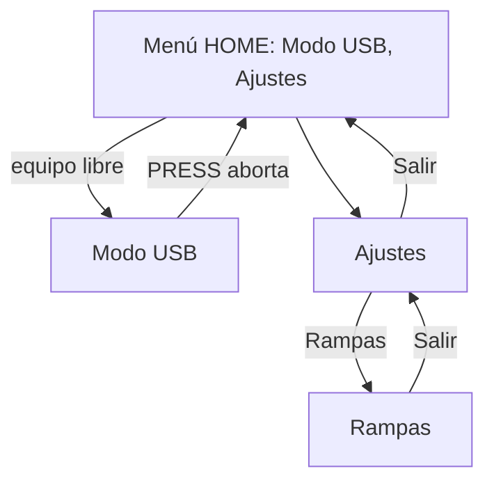
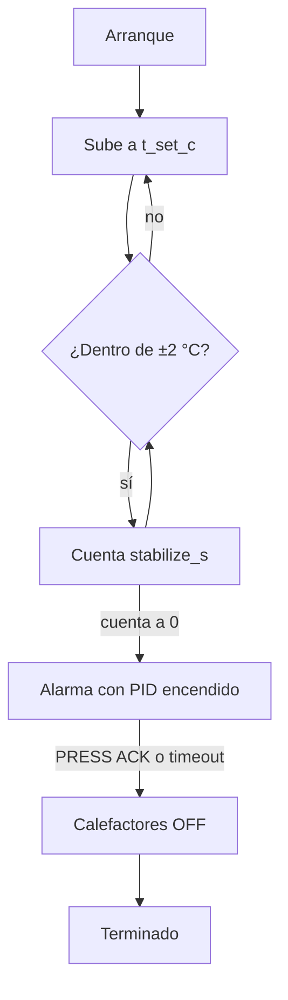
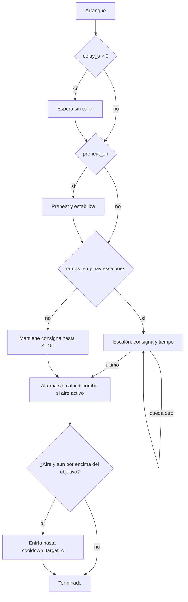
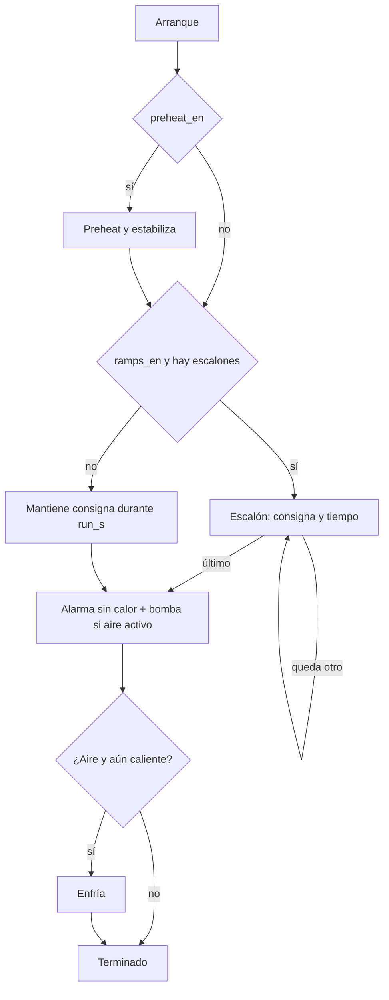

# Características del producto — SMI Soldering Hot Plate

Especificación de comportamiento. Dónde vive cada pieza en el firmware: [architecture.md](architecture.md). Comandos: [usb-automation.md](usb-automation.md).

Firmware: `firmware/avr/`. ATmega16 @ 8 MHz.

Última actualización: 2026-09-26.

## Modelo de control

El calor lo regula un **PID por ventana de tiempo** sobre el banco PTC1+PTC2 (los dos juntos). Los programas encadenan fases. **RAMPS no se lanza**: es un perfil de escalones en EEPROM y un flag `ramps_en`.

| Pieza | Rol |
|-------|-----|
| PID | Sube o mantiene la temperatura de consigna mientras la fase lo pide |
| PREHEAT | Lleva a consigna y espera estable dentro de banda |
| RAMPS | Escalones temperatura/tiempo, después del preheat, si el flag está activo y hay al menos un escalón |
| FIN | Alarma de fin y, si `cooldown_air_en`, bomba de aire hasta `cooldown_target_c` |

## Cómo se navega

Hay tres pantallas: **HOME**, **USB** y **Ajustes**. HOME muestra **Modo USB** y **Ajustes**. La marcha local vuelve como vista nueva; los programas siguen accesibles por AT.

El encoder horario baja el cursor.

| Ítem del menú | Qué hace hoy |
|---------------|--------------|
| Modo USB | Entra si no hay programa ni salidas activas. Si está ocupado, beep |
| Ajustes | Abre la vista de Ajustes |

Comenzar, parar y calibrar PID no tienen fila en HOME: se lanzan por AT. La marcha de un ciclo USB se ve en la pantalla USB.

### Ajustes

Mismo esqueleto que MODO USB: cabecera invertida, 4 filas 5×7 y pie `Salir ↵`. El cursor recorre las filas y termina en el pie; lo invertido es lo que tiene el foco. Cada cambio se guarda en EEPROM al momento.

| Fila | PRESS |
|------|-------|
| Rampas | Abre la página RAMPAS |
| Sonido menu | ON/OFF del beep de navegación (`buzz_nav_en`). La alarma nunca se silencia |
| Precalentar | ON/OFF de la fase preheat en START_IN / STOP_IN (`preheat_en`) |
| Aire al final | ON/OFF de la bomba en el enfriamiento (`cooldown_air_en`) |
| Salir (pie) | Vuelve a HOME |

Página RAMPAS: `Activar` (ON/OFF de `ramps_en`) y `Paso 1..4`, que muestra `150°C 01:30` o `OFF` si el escalón no está en uso. PRESS en un paso edita la temperatura (±5 °C, 30–200), otro PRESS pasa al tiempo (±30 s, 0–60:00) y el tercero guarda. `*` marca el campo en edición. Tiempo 0 corta la lista en ese paso; editar un paso apagado lo añade. El pie vuelve a Ajustes.

En marcha, cuando exista de nuevo la pantalla local, PRESS significa:

- fase de alarma → confirmar (ACK) y seguir a enfriamiento o a terminado;
- cualquier otra fase activa → STOP (ver abajo).

La pantalla local de marcha, cuando vuelva, mostrará el nombre de fase, la temperatura, el tiempo restante si lo hay, y el botón STOP o ACK. Hoy eso se lee en la vista USB (fase, temperatura, tiempo).

## Programas

### PREHEAT

Programa suelto. No usa delay, rampas ni bomba.

En USB la alarma emite `ALARM:PREHEAT-SUCCESS`. STOP durante la subida o la estabilización **aborta**: apaga y vuelve a reposo, sin alarma de fin.

### START_IN

STOP del usuario durante la espera, el preheat, un escalón o el hold **no aborta en seco**: entra a la alarma de fin (sin calor) y a la bomba si corresponde.

### STOP_IN

Igual que START_IN, con dos diferencias: no hay espera inicial, y si no hay rampas corre un tiempo fijo (`run_s`) en lugar de un hold infinito.

`AT+DELAY` escribe a la vez `delay_s` y `run_s`. En STOP_IN el tiempo de marcha es `run_s`.

### Qué hace STOP según el momento

| Situación | PRESS / `AT+STOP` |
|-----------|-------------------|
| START_IN o STOP_IN en espera, preheat, escalón o hold | Pasa a FIN: alarma sin calor y bomba si `cooldown_air_en` |
| PREHEAT suelto, todavía calentando | Apaga y reposo |
| Ya en alarma | ACK: PREHEAT termina; START/STOP sigue al enfriamiento o termina |
| Enfriamiento, o aborto desde la pantalla USB | Apaga calefactores y bomba y vuelve a reposo |

La pantalla USB, al pulsar, además cierra la sesión (`ERROR:ABORTED-BY-DEVICE`) y regresa al menú.

### PID_TUNE

Producto previsto dentro de Ajustes: autoajuste por relé y edición de Kp/Ki/Kd. Hoy no hay fila en HOME. `pid_atune.c` no se enlaza mientras el Makefile define `NO_PID_ATUNE`. El lazo PID de los otros programas sí corre.

### RAMPS

- Interruptor `ramps_en` por `AT+RAMPS` (y, cuando vuelva la vista, en Ajustes).
- Hasta 4 escalones (`RAMP_STEPS_MAX`). Cada uno: temperatura y segundos.
- El editor de escalones es `AT+RAMP=<i>,<temp>,<sec>` (`i` de 0 a 3). Ese comando alarga `ramp_n` si hace falta.
- Entran después del preheat (o en su lugar, si el preheat está apagado) cuando `ramps_en` y `ramp_n >= 1`.
- Cada escalón es una marcha temporizada a esa consigna. Al acabar el último, FIN.

## Ajustes que se guardan

EEPROM versión 3 (`CFG_EEPROM_VER` en `app_config.h`). Código: `src/services/cfg_store.c`.

| Bloque | Qué guarda | Cómo se edita ahora |
|--------|------------|---------------------|
| Global | Ganancias PID, `preheat_en`, `ramps_en`, beep, tiempos de alarma, `stabilize_s`, aire, objetivo de enfriamiento, límite | Ajustes (sonido, precalentar, aire, rampas ON/OFF) o AT (`AT+PREHEAT`, `AT+RAMPS`). El resto, si ya está en EEPROM o por defecto de fábrica |
| Por programa | Consigna y delay/run de PREHEAT, START_IN, STOP_IN y el bloque de PID_TUNE | `AT+TEMP`, `AT+DELAY`. No hay editor en pantalla |
| Rampas | Número de escalones y cada par temperatura/tiempo | Ajustes → Rampas o `AT+RAMP` |

Arrancar un programa vuelve a leer su bloque (`cfg_load_program`) antes de salir.

## MODO USB

Sesión exclusiva. Se entra por el menú o con `AT+DEVICEMODE=USB`, y solo si no hay programa, autotune ni salidas activas. `AT+DEVICEMODE=MANUAL` o el PRESS de la pantalla USB salen a HOME.

La pantalla USB muestra el icono, la temperatura, el programa activo y la fase. El detalle de comandos y de la trama `$HP` está en [usb-automation.md](usb-automation.md).

Comandos que exigen sesión USB (salvo `AT`, `AT+STATUS?`, `AT+DEVICEMODE`):

| Comando | Efecto |
|---------|--------|
| `AT+PROGRAM=PREHEAT\|START_IN\|STOP_IN\|PID_TUNE` | Elige programa y carga su EEPROM. RAMPS no es un valor válido |
| `AT+TEMP=<30..200>` | Consigna del programa activo |
| `AT+DELAY=<0..3600>` | Espera de START_IN y duración de STOP_IN |
| `AT+PREHEAT=0\|1` | Flag global de la fase preheat |
| `AT+RAMPS=0\|1` | Flag global de rampas |
| `AT+RAMP=<i>,<temp>,<sec>` | Un escalón |
| `AT+START` / `AT+STOP` | Arranca el programa elegido, o pide FIN / aborta según la tabla de STOP |

## Compilación

Un target: `make` y `make size`. Gates: `UI_NO_ICONS` (sin iconos en filas), `NO_FONT_6X8`, `NO_PID_ATUNE`.

## Estado de implementación

| Área | Dominio | Pantalla | EEPROM |
|------|---------|----------|--------|
| PREHEAT, START_IN, STOP_IN, FIN | Completo | Solo por AT; la vista USB muestra fase | `AT+TEMP` / `AT+DELAY` |
| Fase RAMPS | Completo | Sin fila en HOME | `AT+RAMP` |
| Lazo PID | Completo | Sin editor de ganancias | Bloque global |
| Autotune PID | Fuente sin enlazar | Sin fila | — |
| Sesión USB / AT | Completo | HOME → Modo USB, y vista de estado | Vía AT |

Fuera del binario a propósito: perfil PANEL, vistas de marcha y ajustes (vuelven en iteraciones siguientes), `PROG_TIMED`, `AT+DURATION`, fuentes 6×8 y 8×12, iconos 8×8 de menú, reproductor de animaciones (`features/parked/`).

Los textos de pantalla viven en flash (`lib/i18n/i18n.c`), no en EEPROM. EEPROM queda para la configuración (66 / 512 bytes). Copiar el catálogo a EEPROM no libera flash: o el texto sigue en la imagen para grabarlo, o la UI se queda sin textos si la EEPROM se borra. El diccionario C++ (clase, segundo idioma, doble buffer) sí se quitó.

Flash medido el 2026-09-26, con Ajustes + Rampas y `-mcall-prologues -mrelax -fno-inline-small-functions`: **15640 / 16384 (95.5%)**. Margen libre: 744 bytes. Volver a medir con `make size` si cambia el enlace.
