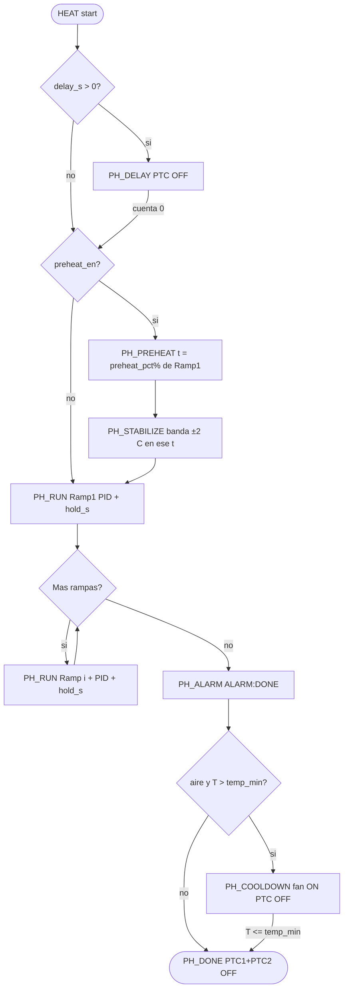

# Flujos de programas — HEAT / PREHEAT / PID / PID_ATUNE

Fuente de verdad del orden de fases, actuadores, EEPROM y alarmas.
Arquitectura: [architecture.md](architecture.md). AT: [usb-automation.md](usb-automation.md).

Última actualización: 2026-09-27. EEPROM global **v5**.

## Actuadores

| Actuador | Hardware | API | Quién lo manda |
|----------|----------|-----|----------------|
| PTC1+PTC2 (banco) | Micro → opto **MOC3021** → triac **BT136** (SSR, no relé mecánico) | `outputs_bank_set` / PID ventana | `pid_tick`, `pid_atune`, preheat |
| Bomba de aire | Fan | `fan_on` / `fan_off` | FIN de HEAT (`PH_ALARM` finish + `PH_COOLDOWN`) |
| Buzzer | Piezo | `buzzer_seq_beep_cat` | Nav, alarma, confirm |

BOM / datasheets: `smd-soldering-hotplate-pcb/smd-soldering-hotplate-pcb.csv` (BT136-600, MOC3021M).

## EEPROM vs estado RAM

| Dato | EEPROM (global v5) | RAM (`app_state_t`) | Notas |
|------|--------------------|---------------------|-------|
| Kp/Ki/Kd ×10 | sí | `pid_kp/ki/kd_x10` | Tras autotune o edición |
| `atune_cycles_target` | sí | igual | Ciclos a completar en autotune |
| `atune_hyst_c_x10` | sí | igual | Histéresis autotune |
| `temp_min_c` | sí | igual | Piso rampas/consignas + OFF aire |
| `temp_max_c` | sí | igual | Techo + corte safety |
| `preheat_en` | sí | igual | 0: HEAT salta PREHEAT→STABILIZE |
| `preheat_pct` | sí | igual | 50..100, default 80. Tope del precalentado de HEAT |
| Rampas | bloque `ee_ramp` | `ramp_n`, `ramp_step[]` | No es programa |
| HEAT `delay_s` | `ee_heat` | `delay_s` | 0 = arranque inmediato |
| PREHEAT `t_set_c` | `ee_pre` | `t_set_c` | Solo AT |
| PID_TUNE `t_set_c` | `ee_tune` | `t_set_c` | Setpoint de oscilación |

Fase viva (`phase`, `t_remain_s`, `ramp_idx`, `duty_pct`) solo en RAM + trama `$HP`.
Picos de autotune (`atune_peak_hi_x10`, `atune_peak_lo_x10`) y ciclos viven en RAM. No hay buffer de traza: 16 KB no alcanza para una página de gráfico.

## Alarmas y notificaciones

La columna **Beep** no es una frecuencia en Hz ni una duración única. Nombra una **categoría**. La categoría fija el ancho de cada pulso; el número es cuántas veces se repite ese pulso (ON, pausa OFF, ON…).

| Categoría | Pulso | Repeticiones |
|-----------|-------|----------------|
| `NAV` | 30 ms ON, 60 ms OFF | `buzz_nav_reps` (1..4). Se puede silenciar |
| `CONFIRM` | 30 ms ON, 60 ms OFF | las de la llamada (abort y ajustes: **2**) |
| `READY` | 50 ms ON, 80 ms OFF | las de la llamada, **mínimo 3** |
| `ALARM` | 50 ms ON, 80 ms OFF | las de la llamada. No se silencia |

| Evento | UART (sesión USB) | Beep | `$HP` ACTION | Notas |
|--------|-------------------|------|--------------|-------|
| PREHEAT standalone listo | línea `ALARM:PH-OK` | `READY`: 3 pulsos de 50 ms ON / 80 ms OFF | `ALARM` | PID hold hasta ACK/timeout. Mientras dura `PH_ALARM`, el mismo `READY` se repite cada `alarm_period_s` |
| HEAT fin de rampas | línea `ALARM:DONE` | igual que la fila anterior | `ALARM` | PTC OFF; aire si `cooldown_air_en` |
| Sobretemperatura | línea `OT` | ninguno | `FAULT` | `OT` significa **over-temperature**: texto literal de UART cuando la lectura válida llega a `temp_max_c`. No es un pitido ni un código de fase. PTC1 y PTC2 OFF, fase `PH_FAULT` |
| Cambio de fase | sin línea UART | ver abajo | token de la fase nueva | El token va dentro de `$HP`, no como línea de alarma |
| Abort USB (PRESS vista) | línea `ERROR:ABORTED-BY-DEVICE` | `CONFIRM`: 2 pulsos de 30 ms ON / 60 ms OFF | — | Todo OFF → HOME |

Beep en un cambio de fase:

- Entrar en `HOLD` o `DONE`: `READY` (3 pulsos de 50 ms ON / 80 ms OFF).
- Entrar en `ALARM`: el mismo `READY` en el acto (no espera al tick de 1 s) y luego cada `alarm_period_s`.
- `WAITING`, `PREHEATING`, `STABILIZING`, `RUNNING` y `COOLING` no pitan.

Tokens de `$HP` ACTION: `WAITING`, `PREHEATING`, `STABILIZING`, `RUNNING`, `COOLING`, `DONE`, `TUNING`, `ALARM`, `FAULT`, `IDLE`.

ACK UI/`AT+STOP` en `PH_ALARM`: cierra alarma; HEAT puede pasar a `PH_COOLDOWN`.

---

## HEAT (`PROG_HEAT`)

Lanzable: **UI** (Home → Heat) y **AT** (`AT+PROGRAM=HEAT` + `AT+START`).

### Entradas

- `delay_s` (0..3600): si >0 → `PH_DELAY` sin calor
- Perfil RAMPS (`ramp_n` ≥ 1): T y `hold_s` por paso
- `pid_k*`, `temp_min_c` / `temp_max_c`, `cooldown_air_en`

### Flujo

### Actuadores por fase

| Fase | PTC (SSR) | Fan | Condición de avance |
|------|-----------|-----|---------------------|
| DELAY | OFF | OFF | `t_remain_s` → 0 |
| PREHEAT / STABILIZE | PID AUTO al `preheat_pct` % de Ramp1 | OFF | en banda ±2 °C de **ese tope** durante `stabilize_s`. Si `preheat_en=0`, estas fases no corren |
| RUN (rampa i) | PID AUTO a `ramp_step[i].temp_c` | OFF | `hold_s` agotado → `ramp_idx++` |
| ALARM (fin) | OFF | ON si aire | timeout/ACK → COOLDOWN o DONE |
| COOLDOWN | OFF | ON | `temp ≤ temp_min_c` → fan OFF, DONE |
| DONE | OFF | OFF | — |

### RAMPS

- No se lanzan solos. Si `preheat_en`, primero se sube solo hasta `preheat_pct` % de T(Ramp1) (default 80) y se estabiliza ahí. Así el tiempo de banda no se cumple con la placa ya en, o por encima de, la temperatura de la rampa. Después **Ramp1 corre su hold completo a T plena**, luego 2..n.
- `preheat_en=0` (Ajustes → ESTAB, o `AT+PREHEAT=0`) salta PREHEAT y STABILIZE y entra en Ramp1.
- `preheat_pct` (Ajustes → P%, 50..100, paso 5) es el tope de ese tramo. No cambia la consigna del `PH_RUN`.
- Preheat del pipeline **no** sustituye Ramp1.

### UI delay

1º PRESS en Heat: edita `delay_s` (±60 s, **incluye 0**). 2º PRESS: guarda EEPROM y `program_start`.

---

## PREHEAT (`PROG_PREHEAT`)

Solo **AT**. Sin rampas, sin delay, sin bomba.

| Fase | PTC | Avance | Alarma |
|------|-----|--------|--------|
| PREHEAT → STABILIZE | PID a `t_set_c` pleno (ee_pre) | banda + `stabilize_s` | — |
| ALARM | PID hold | ACK/timeout | `ALARM:PH-OK` |
| DONE | OFF | — | — |

STOP durante subida: abort → IDLE (sin alarma de fin).

`preheat_pct` no aplica aquí: el programa pide esa temperatura. El tope del 80 % es solo el precalentado del pipeline HEAT, para no sentarse en T(Ramp1) antes del hold de la rampa.

---

## PID (lazo)

- Ventana time-proportioning (`PID_WINDOW_MS`): duty % → tiempo ON del banco PTC (gate MOC3021/BT136).
- Activo en `PH_PREHEAT`, `PH_STABILIZE`, `PH_RUN`, `PH_HOLD`, y `PH_ALARM` con `alarm_hold_heat`.
- Ganancias: EEPROM global / edición Ajustes→PID.

---

## PID_ATUNE (`PROG_PID_TUNE`)

UI (Ajustes→PID→Auto) o AT. Oscilación bang-bang con histéresis `atune_hyst_c_x10` alrededor de `t_set_c` hasta `atune_cycles_target` ciclos → Ziegler–Nichols → `atune_kp/ki/kd` → `pid_atune_apply` + `cfg_save_global`.

Cada muestra a 1 Hz copia los picos del medio ciclo en `atune_peak_hi_x10` / `atune_peak_lo_x10`. `atune_cycles` cuenta ciclos ya cerrados. `atune_kp/ki/kd_x10` quedan al terminar.

| Origen | Qué se publica |
|--------|----------------|
| USB (`CTRL_USB`) | `atune_stream=1`. La trama normal `$HP` sale a 1 Hz, y una más al pasar a DONE o FAIL. Campos para graficar: `T` (un decimal), `SET`, `DUTY` (0 o 100), `P1`/`P2`, `ACTION=TUNING` |
| UI | sin stream. Ajustes → PID → Auto muestra `RUN` / `OK` / `FAIL`. Los picos y las ganancias quedan en `app_state`. Salir con DONE aplica Kp/Ki/Kd |

La banda de oscilación es `t_set ± atune_hyst_c_x10`. No hay trama aparte `$HP,PLOT` ni página de curva: no caben en flash.

| Fase atune | PTC | `$HP` ACTION |
|------------|-----|--------------|
| RUN | ON/OFF según hyst | `TUNING` |
| DONE / FAIL | OFF | — |

Cancel: STOP / Salir / fault apaga el stream sin trama extra. Los picos del último medio ciclo siguen en `app_state` hasta el siguiente arranque.
