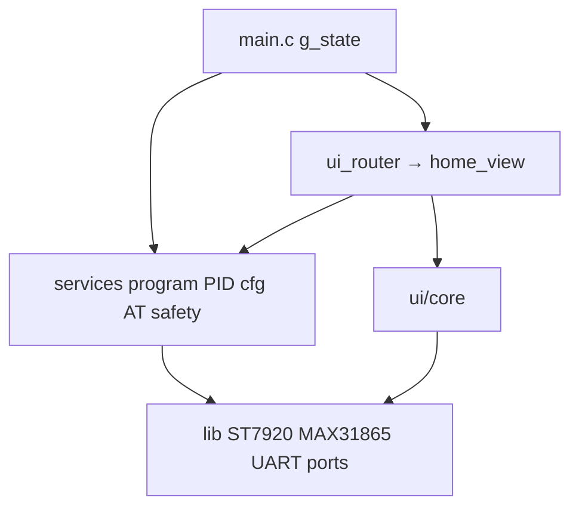
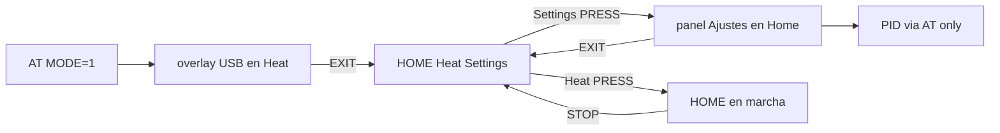
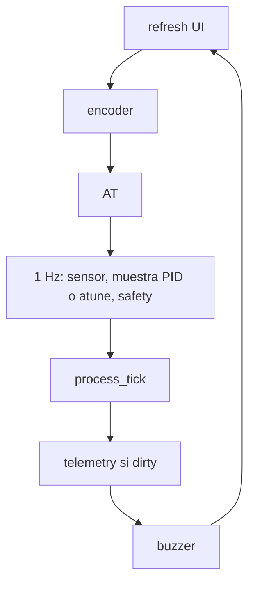

# Arquitectura del firmware AVR

Maestro de fases, alarmas y EEPROM: [program_flows.md](program_flows.md). Si este archivo discrepa, manda ese.  
Producto (+ mapa código): [product_features.md](product_features.md).
UI: [ui_style_guide.md](ui_style_guide.md). AT: [usb-automation.md](usb-automation.md).  
Flash / minify: [feature_budget.md](feature_budget.md) (skill `hotplate-feature-budget`).  
PI / Autotune: [pid_control.md](pid_control.md).  
Temporización (sin bloquear): [temporizacion_no_bloqueante.md](temporizacion_no_bloqueante.md).

Última revisión: 2026-09-29. Un solo binario (`make`). Sin perfiles PANEL/USB.

## Core vs shell

| Capa | Incluye | Regla |
|------|---------|-------|
| **Core** | `program_runner`, `pid`, `pid_atune`, `cfg_store`, `at_cmd`, `app_state`, sensor, safety, outputs, alarmas/beeps | Dueño del comportamiento térmico. En conflicto de flash, el core gana. |
| **Shell** | `home_view` (Heat + Ajustes embebido + overlay USB), ST7920, fonts, i18n | Adaptador: refleja `app_state_t`. No redefine la secuencia. |

Presupuesto de UI (iconos, animaciones, fuentes grandes): se decide con **`make size`** + [feature_budget.md](feature_budget.md), no con prohibiciones eternas. Mientras el margen sea mínimo, no se enlazan módulos parked (`features/parked/`). **UI aprobada** (iconos 16×16, temperatura 8×12) no se sacrifica para meter AT opcional.
## Actuador de calor

Banco PTC1+PTC2: GPIO → optoacoplador **MOC3021** → triac **BT136** (SSR). No es un relé mecánico. Ver BOM PCB y [program_flows.md](program_flows.md).

## Árbol

```
firmware/avr/
  src/main.c                 super-loop; g_state
  src/app/                   app_state.h, app_config.h (EEPROM v8)
  src/ui/                    home (Heat|Ajustes embebido|overlay USB)
  src/ui/core/               window, bands, texto
  src/services/program/      máquina de fases (HEAT con fase PREHEAT / PID_TUNE)
  src/services/pid*.c        lazo + autotune
  src/services/cfg_store.c   EEPROM global + heat/pre/tune + rampas
  src/services/at_cmd.c      AT
  lib/                       drivers + i18n
```

## Capas



## Estado

Una `app_state_t` en `main.c`. Programas lanzables: `HEAT`, `PID_TUNE`. PREHEAT es fase de HEAT. **RAMPS** solo perfil EEPROM.

| Campo clave | Rol |
|-------------|-----|
| `program` / `phase` | Qué corre y en qué etapa |
| `delay_h` / `delay_m` | HEAT: 00:00 = inmediato; si no, PH_DELAY. Tope 12:00. Cuenta atrás en `dly_h/m` + `dly_s` (0…59) |
| `ramp_*` | Perfil de escalones |
| `temp_min_c` / `temp_max_c` | Safety + límites de consignas; aire OFF en min |
| `pid_k*` / `atune_*` | Lazo y autoajuste. Picos en RAM. Un `$HP` a 1 Hz en toda la sesión USB; `atune_stream` lo enriquece durante el autotune. Sin `$HP,PLOT` ni buffer de traza |
| `preheat_en` / `preheat_pct` | HEAT: saltar PREHEAT→STABILIZE, o tope en % de Ramp1 |
| `device_mode` | MANUAL vs USB |

## Navegación



PREHEAT no es programa ni casilla de Home: es la fase de HEAT. UI Ajustes: header `SETUP`, 2 px de aire, R1…R4 + reloj **DLY** (`hh:mm`, tope 12:00); bandas de 9 px y 1 px de separación, 4 filas visibles con desplazamiento. Heat: temp 2×, fase, `Rx T°C` y tiempo, transcurrido `mm:ss`. Aire y PID solo AT.

## Super-loop



En ese tick de 1 Hz se arma el beep `READY` al entrar en `HOLD` o `DONE`, y en USB se marca la telemetría pendiente: sale un `$HP` por muestra ([usb-automation.md](usb-automation.md)). El UART va a 19200; cada trama bloquea 34–54 ms.

Detalle de fases: [program_flows.md](program_flows.md).

## Seguridad

- Boot, fault y sobretemperatura: PTC y fan OFF.
- `temp ≥ temp_max_c` (lectura válida) → UART **`ERROR:7`**, fase `PH_FAULT`, `$HP` `A=FAULT`. El corte (defecto 210 °C, rango 40…260) no es el techo de consigna (250 °C).
- Subida imposible: 180 s con duty ≥ 95 %, pendiente ≤ 0,2 °C/s y T bajo la banda → **`ERROR:9`**, calor OFF, `PH_FAULT`.
- Sensor inválido con programa activo (salvo DELAY/ALARM) → fault.

## Flash

Límite ATmega16: **16384 B**. Medir con `make size` tras cada cambio. Fuentes enlazadas: `FONT_5X7`, `FONT_8X12` (temperatura con `°C`), `FONT_5X7_X2` (misma tabla a 2×, título USB) y `FONT_ICONS` (Heat/CFG).
