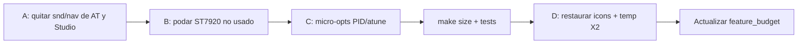

# Plan de optimización de firmware (sin romper cores ni UI aprobada)

Contexto inicial: flash **~16374 / 16384 B**, con la UI visual aprobada (iconos 16×16, temperatura 2×) **regresionada** por recortes previos. Ejecutado el 2026-09-29: ver [Estado](#estado-2026-09-29). Este plan busca **margen real** en drivers/AT/CFG descartable y **devolver** esa UI, no seguir financiando features a costa del shell.

Maestro de reglas: [feature_budget.md](feature_budget.md).  
Agente/skill guardián: `.cursor/skills/hotplate-feature-budget/SKILL.md` (actualizar el doc tras cada `make size`).
Producto: [product_features.md](product_features.md) · Flujos: [program_flows.md](program_flows.md) · AT: [usb-automation.md](usb-automation.md) · UI: [ui_style_guide.md](ui_style_guide.md).

---

## Objetivos

1. Liberar **≥ 350–450 B** de flash (margen cómodo + restaurar icons + X2).
2. **No** alterar comportamiento térmico aprobado (HEAT / PREHEAT / HOLD / PI / autotune / safety).
3. **Restaurar** contrato UI de [ui_style_guide.md](ui_style_guide.md).
4. Alinear producto: **sacar sonido de navegación** de features, AT y HotPlate Studio (beeps de proceso se quedan).

Cada paso: `make size` + `usb-host-test` (y `flow-host-test` / `pid-host-test` si aplica); anotar Δ en [feature_budget.md](feature_budget.md).

---

## Fase A — Inventario AT / CFG (qué exponer)

### Mantener (útiles para operación y chart)

| Comando | Por qué |
|---------|---------|
| `AT+MODE` | Mutex USB/manual |
| `AT+RUN=1` / `AT+RUN=2…` / `AT+STOP` | Arranque HEAT y autotune |
| `AT+CFG?` → `$CF` | Ajustes de HotPlate Studio |
| `AT+CFG=R` / `R?` → `$R` | Soldering Profile |
| `AT+CFG=S` | Límites seguros |
| `AT+CFG=H` | Retraso de HEAT (0…43200 s = 00:00…12:00, guardado como hora+minuto) y aire |
| `AT+CFG=B` | Bandas BN/BX (o fusionar luego en H si cabe `AT_LINE_MAX`) |
| `AT+CFG=P` | Kp/Ki (Kd fijo 0) |
| `AT+CFG=T` / `A` | Autotune |
| `$HP` | Chart: fase, SET, DU, RI, autotune AP… |

### Recortar o dejar de documentar como feature

| Ítem | Acción propuesta | Riesgo |
|------|------------------|--------|
| **`snd` en `AT+CFG=H`** | Quitar parámetro; dejar beeps de proceso siempre según alarmas | Bajo — alinear con “sin sonido nav” |
| **`buzz_nav_en` / `buzz_nav_reps` en EEPROM** | Fijar compile-time o eliminar en bump EEPROM v9 | Medio (bump ver) |
| **Ajustes de HotPlate Studio “Sonido de navegación”** | Quitar control de producto | Bajo |
| **`KD` en `AT+CFG=P`** | Aceptar solo `P,kp,ki` o forzar kd=0 sin parse | Bajo |
| **Campos `$CF` ya omitidos** (`SND`, `RN`, `KD`) | No reintroducir | — |
| **Fusionar `CFG=B` → `CFG=H`** | Solo si la línea AT ≤ 31 chars en peores casos | Medio (compatibilidad con HotPlate Studio) |

**No sacar:** BN/BX, PH/PCT/SB, AIR, AMS, rampas, PID Kp/Ki, límites S.

---

## Fase B — Driver ST7920 (alto ROI)

El Home enlazado usa sobre todo: `st7920_init`, `graphics_mode`, `draw_band`, escritura GDRAM / clear, tipografía vía `st7920_text` / fonts.

API pública con **poca o nula** evidencia de uso en `src/` (candidatos a no enlazar o `#if 0` / split .c):

- `st7920_draw_line`, `st7920_draw_rect`, `st7920_draw_progressbar`
- `st7920_draw_text` (modo texto clásico) si solo se usa GDRAM
- `st7920_print` / `st7920_goto` si no hay callers
- Cola diferida `st7920_render` / `clear_commands` si el camino actual es GDRAM directo
- `st7920_write_frame_pgm` / animaciones si no están en el binario activo

**Plan de trabajo**

1. `avr-nm` / referencias: listar símbolos ST7920 vivos en `firmware.elf`.
2. Partir `st7920_draw.c` en “core GDRAM” vs “primitivos geométricos”; no compilar geométricos.
3. Acortar `st7920_text.c` a glifos 5×7 (+ escala 2× solo si se restaura X2).
4. Medir Δ; **no** tocar layout Home en esta fase.

Expectativa: **100–300 B+** según cuánto esté vivo hoy (confirmar con nm).

---

## Fase C — PID y Autotune (comprimir implementación, no el comportamiento)

Ambos se consideran **funcionando bien**. Objetivo: mismo contrato, menos bytes.

### PID (`pid.c`)

- Mantener: `t_ref`, lookahead, anti-windup, ventana SSR, `pid_on_set_step`.
- Candidatos: unificar clamps; evitar ramas muertas; no reintroducir filtro de tasa caro si el actual basta.
- **No** mover RISE/LOOKAHEAD a EEPROM en este plan (cuesta flash de AT/cfg).
- Validar con `pid-host-test` + traza de banco.

### Autotune (`pid_atune.c`)

- Mantener: bang-bang, Z–N PI, copia de Kp/Ki a EEPROM al terminar, campos `AP/AC/AK/AI` en el `$HP` (sin segunda trama ni `CFG=A`).
- Candidatos: compactar aritmética Ku/Ti; eliminar almacenamiento `Kd` ya siempre 0; reducir locals.
- Validar con flujo AT documentado + `usb-host-test`.

Expectativa realista: **30–100 B** entre ambos si se mide con cuidado (LTO ya aplasta mucho).

---

## Fase D — UI: restaurar lo aprobado (después de A–C)

Orden cuando el libre ≥ ~400 B:

1. Re-enlazar **`FONT_ICONS`** y sidebar 16×16 (Heat / CFG) según [ui_style_guide.md](ui_style_guide.md).
2. Restaurar **temperatura `FONT_5X7_X2`** (y título USB si aplica).
3. Actualizar [feature_budget.md](feature_budget.md): S2/S3 → “enlazado”.
4. Prohibir nuevos PR que vuelvan a bajar S2/S3 sin entrada explícita en el presupuesto.

---

## Fase E — Otros archivos (revisión sistemática)

| Área | Qué mirar | Acción típica |
|------|-----------|---------------|
| `at_cmd.c` | Parser / tablas PROGMEM | Acortar nombres; menos copias |
| `telemetry.c` | Campos `$HP` | No tocar A/SET/DU/RI/AP |
| `cfg_store.c` | Validaciones duplicadas | Compactar clamps |
| `home_view.c` | Lógica Settings R1–R4 | No quitar filas; sí deduplicar edit |
| `buzzer_seq.c` | Tras quitar nav flag | Simplificar API NAV |
| `font8x12.c` | Enlazado: temperatura (UI aprobada) | Solo glifos `-.0-9°CER` |
| `features/parked/` | No enlazar | Mantener parked |
| HotPlate Studio `settings_view` | Quitar control SND | Alinear con F2 |

---

## Orden de ejecución recomendado

### Criterio de éxito

| Métrica | Meta |
|---------|------|
| `make size` Program | ≤ **16000 B** tras A–C (margen ≥ 384 B) ideal; mínimo dejar margen para D |
| Tras D | Icons + X2 enlazados y Program ≤ **16384** |
| Tests | `usb-host-test` `flow-host-test` `pid-host-test` OK |
| Banco | HEAT con 2 rampas sin overshoot grave vs baseline actual |
| Producto | Sin feature “sonido navegación”; UI visual restaurada |

---

## Fuera de alcance (ahora)

- Cambiar algoritmo PI (RISE/LOOKAHEAD) salvo experimento de banco documentado.
- Migraciones EEPROM complejas más allá de v9 para quitar `buzz_nav_*`.
- Ampliar `FONT_8X12` a ASCII completo, animaciones parked, o AT de programas eliminados (START_IN, etc.).

---

## Estado (2026-09-29)

| Fase | Resultado | Δ Program |
|------|-----------|-----------|
| D (medida primero) | Iconos 16×16 Heat/CFG + separador x=31 + temp y título USB a 2× | +214 B |
| A | `buzz_nav_*`, `snd` y `kd` fuera de estado, AT, `cfg_store` y HotPlate Studio. EEPROM v8 sin bump (bytes `rsv`). API `buzzer_seq_beep_cat(cat, n)` | −262 B |
| B | `avr-nm`: la API geométrica ya no se enlazaba. Ganancia real en el blit: buffer `uint8_t row[16]` y un solo `st7920_glyph_row` para COLS 1×/2× y ROWS | −198 B |
| C | Solo `pid_atune_result(kp, ki)` sin kd. El lazo PI y el autotune no se tocaron | ~0 B |
| E | Icono USB fuera de `FONT_ICONS` (`-DFONT_ICONS_USB` para volver a compilarlo) | −32 B |

Resultado: **16096 B** (288 B libres) con la UI aprobada enlazada. `make test` OK. Queda pendiente la prueba en banco de HEAT con 2 rampas.

Siguiente margen posible, sin tocar core: `home_view_on_event` (edición de Settings, ~850 B inlineados en `ui_router_on_event`) y `cfg_load_ramps`/`cfg_save_ramps` (validación duplicada).
