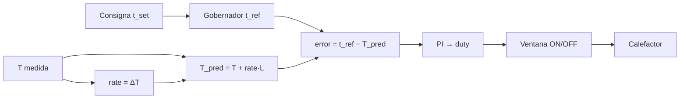

# Control térmico de HotPlate — PI predictivo y autoajuste

Guía **autosuficiente** para entender y portar el mismo comportamiento a otros proyectos, agentes o skills.

| Dónde está el código | Para qué |
|----------------------|----------|
| `firmware/avr/src/services/pid.c` | Lazo de trabajo |
| `firmware/avr/src/services/pid_atune.c` | Autoajuste |
| `firmware/avr/src/app/app_config.h` | RISE, LOOKAHEAD, ventana SSR |
| [program_flows.md](program_flows.md) | Cuándo corre en el ciclo HEAT |

**De un vistazo**

- Planta: HotPlate con mucha inercia (PTC), sensor lento (~1 Hz), actuador on/off (SSR).
- Lazo de trabajo: **PI** (sin D) con referencia que sube a ritmo limitado y **anticipación** de la cola térmica.
- Identificación: oscilación todo/nada → Ziegler–Nichols método 2, regla **PI**.

---

## 1. Cómo se miden las cosas en el firmware

En el micro casi todo va en enteros. Las temperaturas se guardan **×10** (una décima de grado = 1 unidad).

| Símbolo | En el firmware | En la vida real |
|---------|----------------|-----------------|
| `T` | °C × 10 (`temp_c_x10`) | Temperatura medida |
| `t_set` | °C enteros | Consigna de la etapa (Soldering Profile) |
| `t_ref` | °C × 10 | Referencia interna que el lazo persigue (no es el SET de golpe) |
| `rate` | (°C × 10) / muestra | Cuánto subió o bajó T desde la muestra anterior (~°C×10 por segundo si la muestra es 1 s) |
| `Kp` | entero × 10 | Ganancia proporcional (`pid_kp_x10`) |
| `Ki` | entero × 100 | Ganancia integral por segundo (`pid_ki_x10`; nombre interno heredado) |
| `duty` | 0…100 % | Parte de cada ventana en la que el calefactor está ON |
| `I` | acumulador × 10 | Integral del error (con anti-windup) |

Un cálculo del lazo = **una muestra de temperatura** (`TEMP_PERIOD_MS`, por defecto **1000 ms**).

---

## 2. Cómo está armado el lazo



Idea simple: no pedimos el SET de golpe. Subimos una referencia interna, miramos un poco al futuro (porque HotPlate sigue calentando después de cortar) y con ese error calculamos cuánta potencia aplicar.

### 2.1 Cuándo corre

| Situación | Qué hace |
|-----------|----------|
| Sensor válido y lazo en AUTO | Calcula una muestra (`pid_compute_sample`) |
| Fases típicas de HEAT | Precalentamiento, estabilización, subida, meseta |
| Cada vuelta del programa | Aplica el duty a la ventana SSR (`pid_window_tick`) |
| Arranque / parada / fallo / aplicar autoajuste | `pid_reset` (limpia I y rate; `t_ref` = T actual) |
| Nuevo SET de rampa (sin tocar I) | `pid_on_set_step`: rate = 0, `t_ref` = T |

### 2.2 Gobernador de referencia (`t_ref`)

Objetivo: no exigir el SET de golpe (evita saturar y pasarse de temperatura por inercia).

Cada muestra (~1 s):

- Si `t_ref` aún está por debajo del SET × 10:

$$
t_{\mathrm{ref}} \leftarrow \min(t_{\mathrm{set}} · 10,\ t_{\mathrm{ref}} + R)
$$

- Si no (ya alcanzó o el SET nuevo es menor o igual):

$$
t_{\mathrm{ref}} \leftarrow t_{\mathrm{set}} · 10
$$

| Variable | Default | Qué cambia si la mueves |
|----------|---------|-------------------------|
| `RISE_C_X10_DEFAULT` ($R$) | **12** (= 1,2 °C/s con muestra de 1 s) | Qué tan rápido “pide” subir la referencia |

Subir $R$ → llega antes, más riesgo de cola. Bajar $R$ → más lento y suave.

En el Soldering Profile (solo ascendentes), HotPlate no rampa hacia abajo: si el SET nuevo es ≤ `t_ref`, salta al SET.

### 2.3 Anticipación de cola (lookahead)

Primero se estima la velocidad de cambio:

$$
\dot{T} \approx \mathtt{rate}
\quad\text{(por muestra)}
$$

Luego la temperatura “que habrá” dentro de $L$ segundos (con tope para no desbordar enteros):

$$
T_{\mathrm{pred}} = T + \mathrm{clip}(\dot{T} · L,\ ±5000)
$$

Y el error que ve el PI:

$$
e = t_{\mathrm{ref}} - T_{\mathrm{pred}}
$$

| Variable | Default | Qué cambia si la mueves |
|----------|---------|-------------------------|
| `LOOKAHEAD_S_DEFAULT` ($L$) | **15** s | Anticipación del corte. Con $L = 15$ y 1,2 °C/s ≈ **18 °C** de margen mental |

$L$ grande → corta lejos del SET (más preciso, más lento cerca).  
$L$ pequeño → más agresivo, más overshoot.

El clip ±5000 (= ±50 °C en la predicción) evita overflow en enteros.

### 2.4 PI y anti-windup

Si el duty **no** está saturado a favor del error, el modelo ideal actualiza:

$$
I \leftarrow \mathrm{clip}(I + e,\ ±10000)
$$

En el ATmega16 se usa la forma equivalente cuantizada: cada 10 muestras se
acumula el error actual en `I10`, con tope ±1000. Así `I10 ≈ I/10` y se evita
enlazar una división signed de 32 bits que no cabe en el flash:

$$
I_{10} \leftarrow \mathrm{clip}(I_{10} + e,\ ±1000)
\quad\text{cada 10 muestras}
$$

Salida interna (0…1000) y duty en %:

$$
u = \mathrm{clip}\left(\frac{K_{p,x10} · e + K_{i,x100} · I_{10}}{10},\ 0,\ 1000\right)
$$

$$
\mathrm{duty\%} = u / 10
$$

$K_p$ se guarda ×10 y $K_i$ ×100. El nombre interno `pid_ki_x10` se
conserva por compatibilidad, pero su unidad real es ×100. El firmware anterior
dividía el término integral por 100; debía dividirlo por 10. Eso lo dejaba diez
veces corto y el lazo se equilibraba varios grados bajo el SET.

**No integrar** cuando ya no sirve: `(duty ≥ 100 y e > 0)` o `(duty = 0 y e < 0)`.

| Variable | Origen | Qué hace |
|----------|--------|----------|
| `pid_kp_x10` | EEPROM / `AT+CFG=P` / autoajuste | Respuesta al error predicho |
| `pid_ki_x10` | igual; unidad real ×100 | Quita el error residual en meseta; demasiado alto → oscilación lenta |
No hay Kd: ni en `app_state_t`, ni en EEPROM, ni en `AT+CFG=P` (en térmicas lentas el Td de Z–N satura).

Valores de fábrica de referencia: Kp_x10 = **246** (24,6),
Ki_x100 = **10** (0,10/s).

### 2.5 Ventana time-proportioning (SSR)

Cada `PID_WINDOW_MS` (default **1500 ms**):

$$
t_{\mathrm{ON}} = \mathrm{duty\%} × \mathtt{PID\_WINDOW\_MS} / 100
$$

El calefactor está ON mientras `elapsed < t_ON` (con 0 % y 100 % saturados).

| Variable | Influye en |
|----------|------------|
| `PID_WINDOW_MS` | Granularidad del pulso SSR — **no** la pendiente de acercamiento al SET |

El actuador de referencia es opto + triac (SSR). Se puede sustituir por otro on/off si el duty sigue significando “fracción de potencia”.

### 2.6 Cambio de etapa (`pid_on_set_step`)

Al pasar a un nuevo SET (por ejemplo Ramp i):

1. `rate ← 0` — no heredar la velocidad del tramo anterior (evita un duty = 0 fantasma).
2. `t_ref ← T` actual — el gobernador vuelve a subir desde la temperatura real.
3. **No** se pone I = 0 — transición suave entre rampas.

Sin este paso, un lookahead residual del precalentamiento puede apagar el calefactor al entrar en Ramp1.

---

## 3. Cómo afinar en banco

Orden recomendado (primero lo de compilación):

| Prioridad | Parámetro | Si llega lento cerca del SET | Si se pasa de temperatura |
|-----------|-----------|------------------------------|---------------------------|
| 1 | `LOOKAHEAD_S_DEFAULT` | Bajar (p. ej. 30 → 18 → 15) | Subir |
| 2 | `RISE_C_X10_DEFAULT` | Subir (7 → 10 → 12) | Bajar |
| 3 | `pid_kp_x10` / `pid_ki_x10` | Autoajuste o subir Kp con cuidado | Bajar Ki o Kp |
| 4 | `PID_WINDOW_MS` | Solo si el SSR “chapotea”; poco impacto en el tiempo total | — |

Punto de partida validado en HotPlate SMD de inercia alta: RISE ≈ 0,7–1,2 °C/s, LOOK 15–30 s, PI de autoajuste.  
Valores actuales en firmware: **RISE = 1,2 °C/s**, **LOOK = 15 s**.

---

## 4. Autoajuste (aprender la planta)

### 4.1 Idea

Forzar una oscilación alrededor de `t_set` encendiendo y apagando al 100 % (bang-bang con histéresis), medir el periodo $T_u$ y la amplitud $A$, calcular la ganancia límite $K_u$ y aplicar Ziegler–Nichols **PI**.

### 4.2 Parámetros

| Variable | Rango típico | Default | Rol |
|----------|--------------|---------|-----|
| `t_set_c` | **120…150** °C, y dentro de [Tmin .. Tmax−10] | — | Centro de oscilación. Fuera de 120–150 el relé no tiene autoridad y `RUN=2` responde `ERROR:2` |
| `atune_hyst_c_x10` | 1…99 | **15** (±1,5 °C) | Ancho del relé: ON hasta SET+hyst, OFF hasta SET−hyst |
| `atune_cycles_target` | 3…10 | **5** | Ciclos a acumular (tras descartar el heat-up) |
| `atune_max_s` | 120…3600 | **2000** | Tiempo máximo → FAIL |

### 4.3 Qué hace muestra a muestra (~1 s)

1. **ON:** calefactor 100 %, fan OFF. Sigue mientras $T < SET + hyst$. Al cruzar el umbral alto → OFF, fan ON (acelera la bajada), acumula semiperiodo.
2. **OFF:** calefactor 0 %, fan ON. Sigue mientras $T > SET - hyst$. Al cruzar el umbral bajo → ON, fan OFF, acumula semiperiodo.
3. Tras el **2.º** flanco (fin del primer medio ciclo de calentamiento), **reinicia** los picos $T_{\max}$ / $T_{\min}$ para no contar el transient inicial.
4. Cuando hay suficientes ciclos cerrados y semiperiodos → termina OK, salvo que un semiperiodo ON sea ≥ 3× el OFF anterior: en ese caso `FAIL` y no se escribe EEPROM.
5. Si el calefactor lleva **180 s** en ON, la temperatura sigue bajo el umbral alto y la pendiente es ≤ 0,2 °C/s, el pico está aplastado: `FAIL` sin escribir Kp/Ki.

### 4.4 Fórmulas (como en el firmware)

Todo esto ocurre en **`firmware/avr/src/services/pid_atune.c`**: al cerrar el último ciclo se calculan $A$ y $T_u$ en `pid_atune_on_sample`, y con ellos $K_u$, $K_p$ y $K_i$ en `finish_ok`.

#### Paso 1 — Amplitud de la oscilación ($A$)

**Qué responde:** “¿Qué tan grande fue el vaivén de temperatura alrededor del SET?”  
Cuanto mayor $A$, más “floja” parece la planta frente al relé; eso baja la ganancia límite.

$$
A = \frac{T_{\max} - T_{\min}}{2}
$$

($A$ en °C × 10. Si sale menor que 5, el firmware la sube a 5 para no dividir por casi cero.)

```179:182:firmware/avr/src/services/pid_atune.c
        if ((s_half_n / 2u) >= st->atune_cycles_target && s_half_n >= 4u) {
            uint16_t tu_s = (uint16_t)((s_half_sum_s * 2u) / (uint16_t)(s_half_n - 1u));
            int16_t amp = (int16_t)((s_peak_hi - s_peak_lo) / 2);
            finish_ok(st, tu_s, amp);
```

(`s_peak_hi` / `s_peak_lo` se actualizan cada muestra un poco más arriba en la misma función; tras el 2.º flanco se reinician para ignorar el heat-up.)

#### Paso 2 — Periodo de oscilación ($T_u$)

**Qué responde:** “¿Cuánto tarda un ciclo completo ON→OFF→ON?”  
Ese tiempo es el periodo crítico $T_u$; de ahí saldrá el tiempo integral $T_i$.

$$
T_u\ [\mathrm{s}] \approx \frac{2 · \sum \Delta t_{\mathrm{half}}}{n_{\mathrm{half}} - 1}
$$

Se suman las duraciones de cada semiperiodo (`s_half_sum_s`) y se estima el periodo completo. El primer tramo no entra en la suma (`if (s_half_n > 0)` antes de acumular), coherente con descartar el transient.

Mismo fragmento: cálculo de `tu_s` justo antes de `finish_ok` (líneas 179–182 arriba).

#### Paso 3 — Ganancia límite ($K_u$)

**Qué responde:** “Si el relé al 100 % produce oscilación de amplitud $A$, ¿cuál es la ganancia que pondría al lazo justo en el borde de la estabilidad?”  
Fórmula clásica del método del relé, con $d = 100\,\%$ y escala ×10 del firmware:

$$
K_{u,x10} = \frac{4 · 100 · 10}{\pi · A} \approx \frac{12732}{A}
$$

(resultado limitado a 1…999)

```94:109:firmware/avr/src/services/pid_atune.c
static void finish_ok(app_state_t *st, uint16_t tu_s, int16_t amp)
{
    int32_t ku, kp, ki, tu10;

    if (amp < 5)
        amp = 5;
    ku = 12732L / (int32_t)amp;
    if (ku < 1)
        ku = 1;
    if (ku > 999)
        ku = 999;
    if (tu_s < 1u)
        tu_s = 1u;
    tu10 = (int32_t)tu_s * 10L;
    if (tu10 < 10)
        tu10 = 10;
```

#### Paso 4 — De $K_u$ y $T_u$ a ganancias PI (Ziegler–Nichols)

**Qué responde:** “Con esa ganancia límite y ese periodo, ¿qué Kp y Ki usar en el lazo de trabajo?”  
Regla **PI** del método 2 (lazo cerrado):

$$
K_p = 0{,}45 · K_u,\qquad
T_i = \frac{T_u}{1{,}2},\qquad
K_d = 0
$$

En enteros, Kp ×10 y Ki ×100 (lo que realmente guarda HotPlate):

$$
K_{p,x10} = \mathrm{clip}\big(\lfloor K_{u,x10} · 45 / 100 \rfloor,\ 1,\ 999\big)
$$

$$
K_{i,x100} = \mathrm{clip}\big(\lfloor K_{p,x10} · 120 / (T_u · 10) \rfloor,\ 0,\ 999\big)
$$

porque $K_i = K_p / T_i = K_p · 1{,}2 / T_u$. El factor ×100 de Ki
compensa el ×10 de Kp y `tu10 = T_u · 10`.

```111:124:firmware/avr/src/services/pid_atune.c
    /* Z–N PI (método 2): Kp=0.45 Ku, Ti=Tu/1.2, Kd=0 */
    kp = (ku * 45L) / 100L;
    if (kp < 1)
        kp = 1;
    if (kp > 999)
        kp = 999;
    ki = (kp * 120L) / tu10;
    if (ki < 0)
        ki = 0;
    if (ki > 999)
        ki = 999;

    s_kp = (int16_t)kp;
    s_ki = (int16_t)ki;
```

**Por qué no PID completo:** $T_d = T_u / 8$ en plantas lentas satura el techo ×10 (999) y empeora el lazo. HotPlate usa PI + lookahead en su lugar.

**Resumen del encadenamiento:** medir picos → $A$ · medir tiempos → $T_u$ · $A$ → $K_u$ · $K_u$+$T_u$ → $K_p$, $K_i$ → quedan en `s_kp` / `s_ki` y, al terminar, se copian a EEPROM. No hay `AT+CFG=A`.

### 4.5 Cómo se aplica

- Al terminar, `s_kp` / `s_ki` se copian a `pid_kp_x10` / `pid_ki_x10` y a EEPROM. No hay `AT+CFG=A`.
- Durante el autoajuste el PI de trabajo **no** manda; manda el relé.
- El fan en el medio-ciclo OFF es **independiente** del aire de enfriamiento de HEAT.

### 4.6 Telemetría mínima para portar

| Campo | Uso |
|-------|-----|
| Fase | IDLE / RUN / DONE / FAIL |
| Ciclos cerrados | Progreso |
| AK / AI | Kp ×10 / Ki ×100 resultado |

En este producto esos campos van en el mismo `$HP` (`AP`, `AC`, `AK`, `AI`), no en una trama aparte. El `$HP` sale a 1 Hz durante toda la sesión USB y lleva esos campos mientras `ATUNE_RUN` (más la trama de DONE/FAIL). Baud y activación: [usb-automation.md](usb-automation.md).

---

## 5. Checklist para llevarlo a otro MCU / proyecto

1. Sensor periódico (1 s, o escala $R$ y `rate` al `dt` real).
2. Actuador con duty 0…100 % (SSR o PWM equivalente).
3. Copiar gobernador + lookahead + PI + anti-windup + ventana.
4. En cada cambio de SET del Soldering Profile: equivalente a `pid_on_set_step`.
5. Autoajuste opcional: relé + Z–N PI; no mezclar con el PI durante la identificación.
6. Seguridad: cortar calor si $T ≥ T_{\max}$.
7. Validar en banco: subida, meseta dentro de banda, overshoot dentro de tolerancia.

### Pseudocódigo mínimo (lazo)

```
each sample:
  rate = T - T_prev
  if t_ref < SET*10: t_ref = min(SET*10, t_ref + RISE)
  else: t_ref = SET*10
  Tpred = T + clamp(rate * LOOKAHEAD, ±5000)
  e = t_ref - Tpred
  if sample_count % 10 == 0 and not saturated_favor(duty, e):
      I10 = clamp(I10 + e, ±1000)
  u = clamp((Kp_x10*e + Ki_x100*I10)/10, 0, 1000)
  duty = u / 10
each loop:
  apply time_proportioning(duty, WINDOW_MS) to heater
```

---

## 6. Mapa a este repositorio

| Concepto | Archivo / símbolo |
|----------|-------------------|
| Lazo | `src/services/pid.c` |
| Autoajuste | `src/services/pid_atune.c` |
| RISE, LOOKAHEAD, WINDOW | `src/app/app_config.h` |
| Kp/Ki EEPROM | `cfg_store` + `AT+CFG=P` / `A` |
| Fases que llaman al PI | `program_runner` → `pid_tick` |
| Skill agente | `.cursor/skills/hotplate-pid/SKILL.md` |
| Guardián flash | `.cursor/skills/hotplate-feature-budget/SKILL.md` · `feature_budget.md` |

---

## 7. Uso del conocimiento

Algoritmo del proyecto **SMI HotPlate**.  
Autoría: **Crhistian David Vergara Gómez** · krisskira@gmail.com.

Puedes reutilizar las **fórmulas y el procedimiento** en otros proyectos; adapta actuador/sensor y vuelve a validar en banco.
