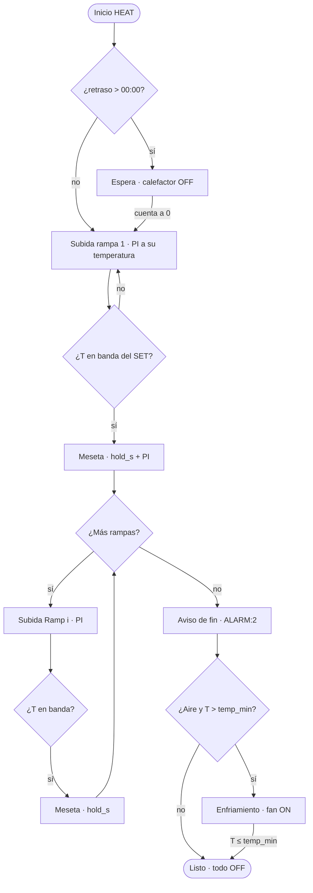

# Flujos de HotPlate — HEAT, PREHEAT, control y autoajuste

Documento **maestro** del orden de fases, actuadores, memoria y alarmas.  
Si otro archivo discrepa en el comportamiento térmico, **manda este**.

| También ver | Para |
|-------------|------|
| [architecture.md](architecture.md) | Cómo está organizado el firmware |
| [usb-automation.md](usb-automation.md) | Comandos AT y tramas `$HP` / `$CF` / `$R` |
| [pid_control.md](pid_control.md) | Fórmulas del PI predictivo y del autoajuste |
| [product_features.md](product_features.md) | Visión de producto (HotPlate, HotPanel, Soldering Profile) y mapa doc↔código |

Última actualización: **2026-09-29**. Formato EEPROM global **v8**.

---

## Qué mueve HotPlate

| Actuador | Hardware | En código | Quién lo manda |
|----------|----------|-----------|----------------|
| Banco calefactor (PTC1+PTC2) | Micro → opto **MOC3021** → triac **BT136** (SSR; no es relé mecánico) | `outputs_bank_set` / ventana PID | Lazo PI, autoajuste, precalentamiento |
| Aire (ventilador / bomba) | Fan | `fan_on` / `fan_off` | Fin de HEAT (`PH_ALARM` / `PH_COOLDOWN` si el aire asistido está activo); en autoajuste, solo en el medio-ciclo OFF |
| Avisos | Buzzer piezo | `buzzer_seq_beep_cat` | Navegación, confirmación, listo, alarma |

BOM y datasheets: `hardware/pcb/` y `hardware/datasheets/`.

---

## Qué se guarda y qué solo vive en marcha

Algunos datos viven en **EEPROM** (sobreviven al apagado). Otros solo existen **mientras corre** el ciclo (RAM + telemetría).

| Dato | En EEPROM (v8) | En RAM (`app_state_t`) | Notas |
|------|----------------|------------------------|-------|
| Ganancias Kp / Ki ×10 | sí | `pid_kp/ki_x10` | Tras autoajuste o edición (sin Kd) |
| Ciclos objetivo del autoajuste | sí | `atune_cycles_target` | Default **5** |
| Histéresis del autoajuste | sí | `atune_hyst_c_x10` | Ancho del “relé” alrededor del SET |
| Tiempo máximo del autoajuste | sí | `atune_max_s` | 120…3600 s; default **2000** |
| Temperatura mínima / máxima | sí | `temp_min_c` / `temp_max_c` | Piso de consignas + corte de seguridad |
| Precalentamiento on/off | sí | `preheat_en` | Si es 0, HEAT salta PREHEAT y STABILIZE |
| % de precalentamiento | sí | `preheat_pct` | 50…100; default **80** (% de la rampa 1) |
| Soldering Profile (rampas) | bloque `ee_ramp` | `ramp_n`, `ramp_step[]` | No es un programa lanzable |
| Retraso de HEAT | `ee_heat` (`uint16`: hora en el byte alto, minuto en el bajo; `flags` bit0 marca este formato) | `delay_h` + `delay_m` | **00:00** = arranque inmediato. Tope **12:00**. Un valor antiguo en segundos (sin ese bit) se convierte al leerlo |
| SET del autoajuste | `ee_tune` | `t_set_c` | Centro de oscilación (`AT+RUN=2`) |

La fase viva (`phase`, tiempo restante, índice de rampa, duty…) solo está en RAM y en la trama `$HP`.  
Los picos y las ganancias resultado del autoajuste viven en estáticos de `pid_atune` (el algoritmo los usa; `$HP` los lee). No van en `app_state` y **no hay** buffer de traza en el equipo.

---

## Alarmas y pitidos

Los pitidos no se definen como “una nota de X Hz”. Cada evento usa una **categoría**: la categoría fija el ancho del pulso; el número indica cuántas veces se repite (ON → pausa OFF → ON…).

| Categoría | Pulso | Cuándo |
|-----------|-------|--------|
| `CONFIRM` | 30 ms ON / 60 ms OFF, 1 vez | HotPanel guardó un valor (rampa, meseta o retraso) en EEPROM |
| `READY` | 50 ms ON / 80 ms OFF, mínimo 3 | Fin de ciclo / aviso de alarma |
| `ALARM` | 50 ms ON / 80 ms OFF | Arranque rechazado (sin rampas o fallo). No se silencia |

No hay pitido de navegación, ni al arrancar, parar o salir de USB.

| Qué ocurre | Por USB | Pitido | Campo `$HP` ACTION | Notas |
|------------|---------|--------|--------------------|-------|
| HEAT termina las rampas | línea `ALARM:2` | `READY`: 3 pulsos | `ALARM` | Calefactor OFF; aire si está activado. Mientras dura `PH_ALARM`, el mismo `READY` se repite cada `alarm_period_s` |
| Sobretemperatura | `ERROR:7` | ninguno | `FAULT` | Lectura válida ≥ `temp_max_c` → PTC OFF, fase `PH_FAULT` |
| Cambio de fase | sin línea aparte | ver abajo | token de la fase nueva | El token va **dentro** de `$HP` |
| Abort desde HotPanel en vista USB | `ERROR:8` | ninguno | — | Todo OFF → HOME |

**Cuándo pitan los cambios de fase**

- Entrar en meseta (`HOLD`) o en terminado (`DONE`): `READY` (3 pulsos).
- Entrar en `ALARM`: el mismo `READY` al instante (no espera al tick de 1 s) y luego cada `alarm_period_s`.
- Espera, precalentamiento, estabilización, subida y enfriamiento **no** pitan.

Tokens de `$HP` ACTION: `WAITING`, `PREHEATING`, `STABILIZING`, `RUNNING`, `COOLING`, `DONE`, `TUNING`, `ALARM`, `FAULT`, `IDLE`.

**Cancelar vs. reconocer el fin**

| Acción | Efecto |
|--------|--------|
| Confirmar en HotPanel / `AT+STOP` durante `PH_ALARM` | Cierra la alarma; HEAT puede pasar a enfriamiento |
| **Cancelar** en HotPanel durante espera / precalentamiento / rampas | Abort seco → `PH_IDLE` (**sin** `ALARM:2`) |
| `AT+STOP` por USB en esas mismas fases | Se trata como fin de ciclo → `PH_ALARM` + `ALARM:2` |

---

## HEAT — el ciclo del Soldering Profile

Se lanza desde **HotPanel** (casilla Heat) o por USB (`AT+RUN=1`).

En esa casilla, HotPanel mantiene la temperatura a 2×, la fase y la fila `Rx T°C` con el tiempo de la etapa. Debajo, centrado, cuenta `mm:ss` desde el arranque (`t_elapsed_s`; `00:00` en reposo). El overlay USB no pinta fase, perfil ni ese contador.

### Qué necesita para arrancar

- Reloj de retraso `00:00`…`12:00` (`delay_h`, `delay_m`): si no es `00:00`, primero cuenta atrás **sin calor**
- Soldering Profile con al menos una rampa (`ramp_n` ≥ 1): temperatura y `hold_s` por escalón
- Ganancias PI, límites `temp_min_c` / `temp_max_c`, y si el aire asistido está activo

### Camino completo

### Qué hace cada fase

| Fase | Calefactor (SSR) | Aire | Cuándo avanza |
|------|------------------|------|---------------|
| Espera (`DELAY`) | OFF | OFF | Cuando el contador llega a 0 |
| Subida (`RUN`, rampa i) | PI al SET del escalón (referencia `t_ref` + anticipación; al entrar se alinea `t_ref` a T) | OFF | Approach controlado: **aún no** cuenta `hold_s`. Al entrar en ± BN → meseta. La rampa 1 es el primer escalón |
| Meseta (`HOLD`, rampa i) | PI mantiene el SET | OFF | Aquí sí corre `hold_s`. Al agotarse → siguiente rampa o fin. El Soldering Profile **no puede bajar** de rampa a rampa (`ERROR:2` si lo intenta) |
| Aviso de fin (`ALARM`) | OFF | ON si el aire asistido está activo | Timeout o confirmación → enfriamiento o listo |
| Enfriamiento (`COOLDOWN`) | OFF | ON | Cuando `T ≤ temp_min_c` → fan OFF y listo |
| Listo (`DONE`) | OFF | OFF | — |

### Soldering Profile

- Las rampas **no** se lanzan solas: forman el Soldering Profile que HEAT recorre, empezando por la rampa 1 a su temperatura.
- No hay una fase previa al porcentaje de la rampa 1. RSS, rampa a pico, reflow o soldadura son el mismo HEAT con más o menos escalones.
- La meseta no se aborta si la temperatura se sale de `BX`. `BX` se guarda; quien decide el paso a meseta es `BN`.

### Retraso desde HotPanel

El retraso se edita en **Ajustes → DLY** como reloj `hh:mm` (pulsar: horas, luego minutos; tope 12:00). En la casilla Heat, un PRESS arranca HEAT; el retraso no se edita ahí. En EEPROM cabe en el `uint16` de `ee_heat`: byte alto = horas, byte bajo = minutos. La cuenta atrás usa esos dos bytes más un contador de 0…59 s, sin guardar las 12 h en segundos.

---

## Rampa 1

No es un programa aparte ni una casilla de HotPanel.  
Es el primer escalón del Soldering Profile: su temperatura y su `hold_s`. No hay `AT+RUN` propio ni cálculo de porcentaje.

---

## Control de temperatura (lazo PI)

Guía completa (variables, fórmulas, tuning, portabilidad): **[pid_control.md](pid_control.md)**.

En pocas palabras:

- La potencia se aplica por **ventanas** (`PID_WINDOW_MS`): el % de duty es cuánto tiempo el SSR está ON dentro de cada ventana.
- Activo en precalentamiento, estabilización, subida y meseta.
- **PI predictivo:** una referencia interna sube hacia el SET a ritmo limitado (`RISE_C_X10_DEFAULT`, p. ej. 1,2 °C/s) y el error mira un poco al futuro (`LOOKAHEAD_S_DEFAULT`, p. ej. 15 s) para cortar antes por inercia. Sin término D (Kd = 0).
- Anti-windup: no integra si el duty ya está saturado a favor del error. Entre rampas **no** se borra el integral; al cambiar de SET se llama `pid_on_set_step` (tasa = 0, `t_ref ← T`) para no heredar la “cola” del precalentamiento.
- Kp/Ki viven en EEPROM (`AT+CFG=P`). HotPanel no edita el PID. `rise` / `lookahead` son de compilación (ahorro de flash). `$CF` no emite `KD` (siempre 0).

---

## Autoajuste (`PID_TUNE`)

Detalle matemático: **[pid_control.md](pid_control.md)** § Autotune.

Solo por USB (HotPlate Studio / AT). HotPanel **no** lo lanza.

1. Opcional: guardar parámetros sin arrancar → `AT+CFG=T,ciclos,hyst,max_s`.
2. Arrancar → `AT+RUN=2,temp,ciclos,hyst[,max_s]`.
3. HotPlate oscila todo/nada alrededor del SET (histéresis `atune_hyst_c_x10`) durante `atune_cycles_target` ciclos.
4. Mide amplitud y periodo → calcula \(K_u\) y \(T_u\) → regla **Ziegler–Nichols PI** (\(K_p=0.45K_u\), \(T_i=T_u/1.2\), \(K_d=0\)).
5. Al terminar, Kp/Ki se copian solos a EEPROM. No hay `AT+CFG=A`.

Si se pasa de `atune_max_s` → fallo (default **2000** s; `$CF AMS=`).

Durante el medio-ciclo OFF el ventilador ayuda a bajar más rápido (protege SMD del tiempo encima de consigna). Eso es independiente del aire al final de HEAT.

| Origen | Qué se publica |
|--------|----------------|
| USB | Hoy: stream `$HP` a 1 Hz con progreso (`AP`, `AC`) y ganancias (`AK`, `AI`); una trama al pasar a DONE o FAIL. Contrato de sesión: el mismo `$HP` del USB, sin segundo emisor ([usb-automation.md](usb-automation.md)) |
| HotPanel | No lanza autoajuste ni dibuja la curva |

No hay trama `$HP,PLOT`. La banda de oscilación es `t_set ± histéresis`.

| Momento del autoajuste | Calefactor | Aire | `$HP` ACTION |
|------------------------|------------|------|--------------|
| Medio-ciclo ON | ON | OFF | `TUNING` |
| Medio-ciclo OFF | OFF | ON | `TUNING` |
| DONE / FAIL | OFF | OFF | — |

Hoy, cancelar (STOP / fault) apaga ese 1 Hz sin trama extra. En el contrato de sesión solo se quitan `AP,AC,AK,AI`; el `$HP` de estado sigue si USB permanece abierto. El siguiente `RUN=2` pone a cero las ganancias resultado hasta el nuevo DONE.
