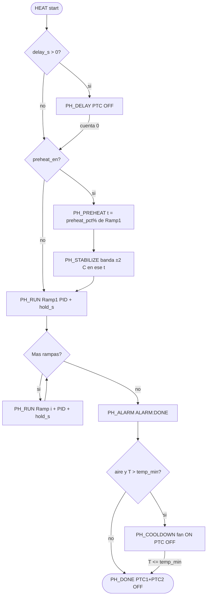

# Flujos de programas — HEAT / PREHEAT / PID / PID_ATUNE

Fuente de verdad del orden de fases, actuadores, EEPROM y alarmas.
Arquitectura: [architecture.md](architecture.md). AT: [usb-automation.md](usb-automation.md).

Última actualización: 2026-09-28. EEPROM global **v7**.

## Actuadores

| Actuador | Hardware | API | Quién lo manda |
|----------|----------|-----|----------------|
| PTC1+PTC2 (banco) | Micro → opto **MOC3021** → triac **BT136** (SSR, no relé mecánico) | `outputs_bank_set` / PID ventana | `pid_tick`, `pid_atune`, preheat |
| Bomba de aire | Fan | `fan_on` / `fan_off` | FIN de HEAT (`PH_ALARM`/`PH_COOLDOWN` si `cooldown_air_en`); autotune en medio-ciclo OFF |
| Buzzer | Piezo | `buzzer_seq_beep_cat` | Nav, alarma, confirm |

BOM / datasheets: `hardware/pcb/` (CSV BOM) y `hardware/datasheets/` (BT136, MOC3021, …).

## EEPROM vs estado RAM

| Dato | EEPROM (global v7) | RAM (`app_state_t`) | Notas |
|------|--------------------|---------------------|-------|
| Kp/Ki/Kd ×10 | sí | `pid_kp/ki/kd_x10` | Tras autotune o edición |
| `atune_cycles_target` | sí | igual | Ciclos a completar en autotune; default **5** |
| `atune_hyst_c_x10` | sí | igual | Histéresis autotune |
| `atune_max_s` | sí | igual | Timeout global autotune (s), 120..3600; default **2000** |
| `temp_min_c` | sí | igual | Piso rampas/consignas + OFF aire |
| `temp_max_c` | sí | igual | Techo + corte safety |
| `preheat_en` | sí | igual | 0: HEAT salta PREHEAT→STABILIZE |
| `preheat_pct` | sí | igual | 50..100, default 80. Tope del precalentado de HEAT |
| Rampas | bloque `ee_ramp` | `ramp_n`, `ramp_step[]` | No es programa |
| HEAT `delay_s` | `ee_heat` | `delay_s` | 0 = arranque inmediato |
| PID_TUNE `t_set_c` | `ee_tune` | `t_set_c` | Setpoint de oscilación (`AT+RUN=2`) |

Fase viva (`phase`, `t_remain_s`, `ramp_idx`, `duty_pct`) solo en RAM + trama `$HP`.
Picos y ganancias resultado del autotune viven en estáticos de `pid_atune` (el algoritmo los usa; la trama los lee). No van en `app_state` ni hay buffer de traza.

## Alarmas y notificaciones

La columna **Beep** no es una frecuencia en Hz ni una duración única. Nombra una **categoría**. La categoría fija el ancho de cada pulso; el número es cuántas veces se repite ese pulso (ON, pausa OFF, ON…).

| Categoría | Pulso | Repeticiones |
|-----------|-------|----------------|
| `NAV` | 30 ms ON, 60 ms OFF | `buzz_nav_reps` (1..4). Se puede silenciar |
| `CONFIRM` | 30 ms ON, 60 ms OFF | las de la llamada (abort y ajustes: **2**) |
| `READY` | 50 ms ON, 80 ms OFF | las de la llamada, **mínimo 3** |
| `ALARM` | 50 ms ON, 80 ms OFF | las de la llamada. No se silencia |

| Evento | UART (sesión USB) | Beep | `$HP` ACTION | Notas |
|--------|-------------------|------|--------------|-------|
| HEAT fin de rampas | línea `ALARM:2` | `READY`: 3 pulsos de 50 ms ON / 80 ms OFF | `ALARM` | PTC OFF; aire si `cooldown_air_en`. Mientras dura `PH_ALARM`, el mismo `READY` se repite cada `alarm_period_s` |
| Sobretemperatura | `ERROR:7` | ninguno | `FAULT` | Corte safety: lectura válida ≥ `temp_max_c`. PTC1 y PTC2 OFF, fase `PH_FAULT`. No es pitido ni código de fase aparte |
| Cambio de fase | sin línea UART | ver abajo | token de la fase nueva | El token va dentro de `$HP`, no como línea de alarma |
| Abort USB (PRESS vista) | línea `ERROR:ABORTED-BY-DEVICE` | `CONFIRM`: 2 pulsos de 30 ms ON / 60 ms OFF | — | Todo OFF → HOME |

Beep en un cambio de fase:

- Entrar en `HOLD` o `DONE`: `READY` (3 pulsos de 50 ms ON / 80 ms OFF).
- Entrar en `ALARM`: el mismo `READY` en el acto (no espera al tick de 1 s) y luego cada `alarm_period_s`.
- `WAITING`, `PREHEATING`, `STABILIZING`, `RUNNING` y `COOLING` no pitan.

Tokens de `$HP` ACTION: `WAITING`, `PREHEATING`, `STABILIZING`, `RUNNING`, `COOLING`, `DONE`, `TUNING`, `ALARM`, `FAULT`, `IDLE`.

ACK UI/`AT+STOP` en `PH_ALARM`: cierra alarma; HEAT puede pasar a `PH_COOLDOWN`.  
Cancel UI (Home **Cancelar**) en DELAY/PREHEAT/RUN: abort seco → `PH_IDLE` (no `ALARM:2`).  
`AT+STOP` USB en esas fases: cierra como fin → `PH_ALARM` + `ALARM:2`.

---

## HEAT (`PROG_HEAT`)

Lanzable: **UI** (Home → Heat) y **AT** (`AT+RUN=1`).

### Entradas

- `delay_s` (0..3600): si >0 → `PH_DELAY` sin calor
- Perfil RAMPS (`ramp_n` ≥ 1): T y `hold_s` por paso
- `pid_k*`, `temp_min_c` / `temp_max_c`, `cooldown_air_en`

### Flujo

### Actuadores por fase

| Fase | PTC (SSR) | Fan | Condición de avance |
|------|-----------|-----|---------------------|
| DELAY | OFF | OFF | `t_remain_s` → 0 |
| PREHEAT / STABILIZE | PID AUTO al `preheat_pct` % de Ramp1 | OFF | en banda ±2 °C de **ese tope** durante `stabilize_s`. Si `preheat_en=0`, estas fases no corren |
| RUN (rampa i) | PID AUTO a `ramp_step[i].temp_c` | OFF | `hold_s` agotado → `ramp_idx++` |
| ALARM (fin) | OFF | ON si aire | timeout/ACK → COOLDOWN o DONE |
| COOLDOWN | OFF | ON | `temp ≤ temp_min_c` → fan OFF, DONE |
| DONE | OFF | OFF | — |

### RAMPS

- No se lanzan solos. Si `preheat_en`, primero se sube solo hasta `preheat_pct` % de T(Ramp1) (default 80) y se estabiliza ahí. Así el tiempo de banda no se cumple con la placa ya en, o por encima de, la temperatura de la rampa. Después **Ramp1 corre su hold completo a T plena**, luego 2..n.
- `preheat_en=0` (Ajustes → ESTAB, o `AT+CFG=H` con en=0) salta PREHEAT y STABILIZE y entra en Ramp1.
- `preheat_pct` (Ajustes → P%, 50..100, paso 5) es el tope de ese tramo. No cambia la consigna del `PH_RUN`.
- Preheat del pipeline **no** sustituye Ramp1.

### UI delay

`delay_s` se edita en **Ajustes → DLY** (±60 s, incluye 0). En casilla Heat, un PRESS arranca HEAT (`program_start`); no hay edición de delay en Heat.

---

## PREHEAT

No es un programa. Es el tramo de HEAT descrito arriba (`preheat_en`, `preheat_pct`, `stabilize_s`). No hay `ee_pre` ni `AT+RUN=0`.

---

## PID (lazo)

- Ventana time-proportioning (`PID_WINDOW_MS`): duty % → tiempo ON del banco PTC (gate MOC3021/BT136).
- Activo en `PH_PREHEAT`, `PH_STABILIZE`, `PH_RUN` y `PH_HOLD`.
- Ganancias: EEPROM global / `AT+CFG=P`. Ajustes no edita PID.

---

## PID_ATUNE (`PROG_PID_TUNE`)

Solo AT: `AT+CFG=T,ciclos,hyst,max_s` (persiste sin arrancar) y `AT+RUN=2,temp,ciclos,hyst[,max_s]`. Oscilación bang-bang con histéresis `atune_hyst_c_x10` alrededor de `t_set_c` hasta `atune_cycles_target` ciclos → Ziegler–Nichols → ganancias en estáticos de `pid_atune` → `AT+CFG=A` (`pid_atune_apply` + `cfg_save_global`).

Timeout: si `atune_elapsed_s > atune_max_s` → `ATUNE_FAIL` (default **2000** s; rango 120..3600; `$CF AMS=`).

Enfriamiento asistido: en el medio-ciclo OFF (calentador apagado) el fan queda ON para acortar la bajada y limitar el tiempo de componentes SMD por encima de la consigna. En medio-ciclo ON y al DONE/FAIL/cancel, fan OFF. (Independiente de `cooldown_air_en`, que solo aplica al fin de HEAT.)

Los picos del medio ciclo no salen de `pid_atune`. `atune_cycles` (en `app_state`) cuenta ciclos ya cerrados. `AK`/`AI`/`AD` de `$HP` salen de `pid_atune_result`.

| Origen | Qué se publica |
|--------|----------------|
| USB (`CTRL_USB`) | `atune_stream=1`. `$HP` de proceso a 1 Hz, más `AP,AC,AK,AI,AD`, y una trama al pasar a DONE o FAIL |
| UI | no lanza autotune ni dibuja la curva |

La banda de oscilación es `t_set ± atune_hyst_c_x10`. No hay trama `$HP,PLOT`.

| Fase atune | PTC | Fan | `$HP` ACTION |
|------------|-----|-----|--------------|
| RUN (medio ON) | ON | OFF | `TUNING` |
| RUN (medio OFF) | OFF | ON | `TUNING` |
| DONE / FAIL | OFF | OFF | — |

Cancel: STOP / fault apaga el stream sin trama extra. El siguiente `RUN=2` pone las ganancias resultado a cero hasta el nuevo DONE.
