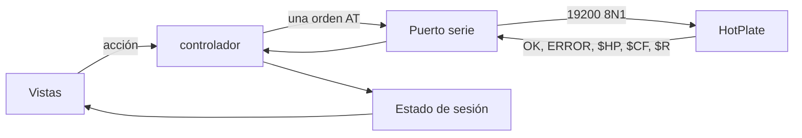
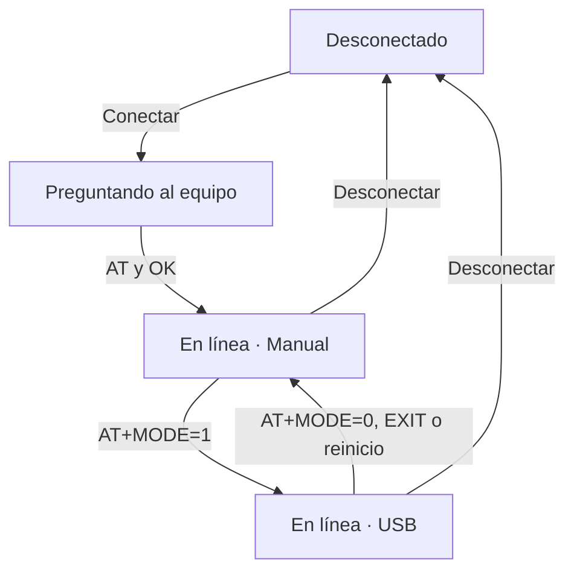

# Cómo está armada

La ventana solo dibuja. Cada botón pide una acción al controlador, el controlador habla con el equipo por el puerto serie, y la respuesta vuelve a pintarse en la vista.

Hay una sola orden en vuelo: se espera `OK` o `ERROR` antes de enviar la siguiente. Una trama `$HP` que llegue en medio no cuenta como esa respuesta.

Al conectar, la app envía `AT` y toma `OK` como «en línea». El saludo `HP` del equipo solo sale al encender, así que abrir el puerto no lo vuelve a ver.

## La sesión

En Manual la app puede preguntar el estado (`AT+STAT?`) cada cierto tiempo. En USB no lo hace: el equipo envía `$HP` solo, una vez por segundo. Al entrar en USB lee el perfil (`$R`) y los ajustes (`$CF`).

Salir de USB ocurre de tres maneras: el botón **Cambiar a modo Manual**, el botón EXIT del panel (`ERROR:8`) o un reinicio del equipo (llega otra vez el saludo `HP`).

## Pantallas

Cinco páginas, más una cabecera y una barra de estado que no cambian:

| Página | Archivo | Para qué |
|--------|---------|----------|
| Conexión | `views/connection_view.py` | Puerto, modo Manual/USB, consola del tráfico |
| HEAT | `views/heat_view.py` | Perfil de hasta 4 escalones y el ciclo |
| Autotune | `views/tune_view.py` | Ensayo que calcula Kp y Ki |
| Ajustes | `views/settings_view.py` | Límites, bandas, retraso, aire y ganancias |
| Apariencia | `views/appearance_view.py` | Fuentes, colores de la gráfica y de la consola |

HEAT y Autotune comparten el panel de estado (`views/status_panel.py`) y la curva con su registro de eventos (`chart.py`). La apariencia no viaja al equipo.

Las cinco páginas están siempre montadas, una encima de otra y del tamaño de la ventana; cambiar de pestaña solo trae una al frente. Así las páginas que no se ven siguen midiendo lo mismo mientras reciben `$HP`. Si se desmontaran, los bloques que se reacomodan según el ancho (estado, HUD) entrarían en un bucle de relayout y congelarían la ventana.

Los nombres que se ven en pantalla (fases, errores, alarmas) salen de `protocol.py`. El orden real del ciclo lo decide el firmware; está en [program_flows.md](../firmware/avr/doc/program_flows.md).

## Archivos

| Archivo | Qué hace |
|---------|----------|
| `app.py` | Arranque |
| `window.py` | Ventana, páginas y el tamaño |
| `controller.py` | Órdenes, sondeo y reparto de las respuestas |
| `state.py` | Datos de la sesión, sin widgets |
| `protocol.py` | Arma las órdenes AT y lee las tramas |
| `serial_link.py` | Puerto a 19200 8N1 y el candado de una orden |
| `heat_logic.py` | Objetivo de temperatura del ciclo HEAT |
| `ramps_store.py`, `tune_store.py`, `theme.py` | Lectura y escritura de los tres JSON |
| `widgets/ui.py` | Botones, tarjetas y campos, dibujados a la medida del diseño |
| `build.sh` | Compila la app a un ejecutable |
| `design/` | Pantallas de Stitch, capturas de la app y las herramientas que las generan ([README](design/README.md)) |
