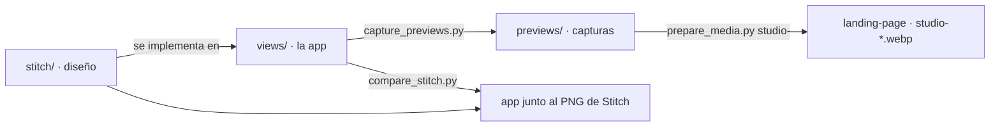
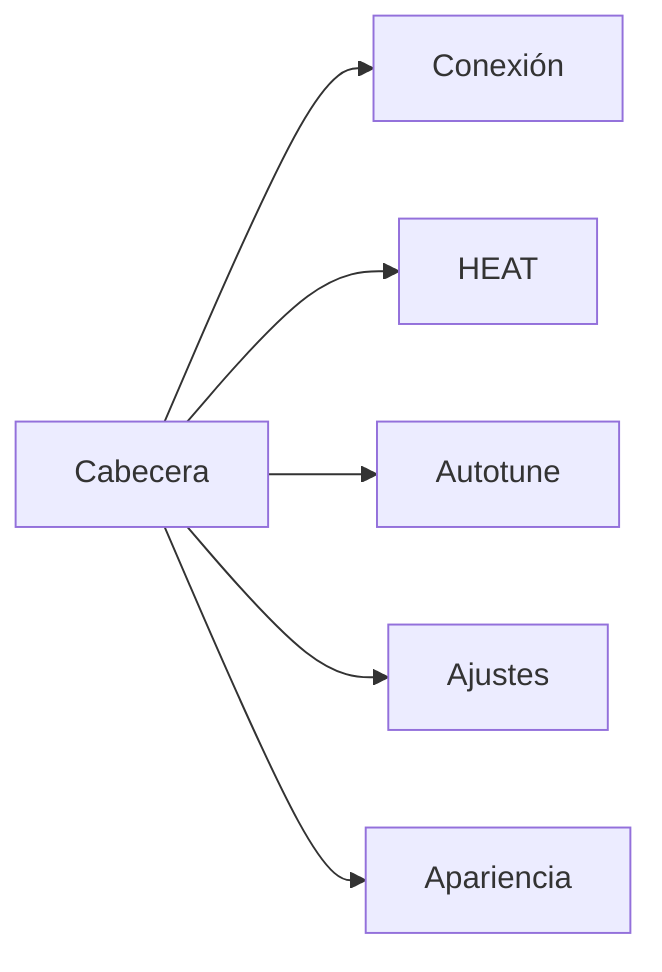
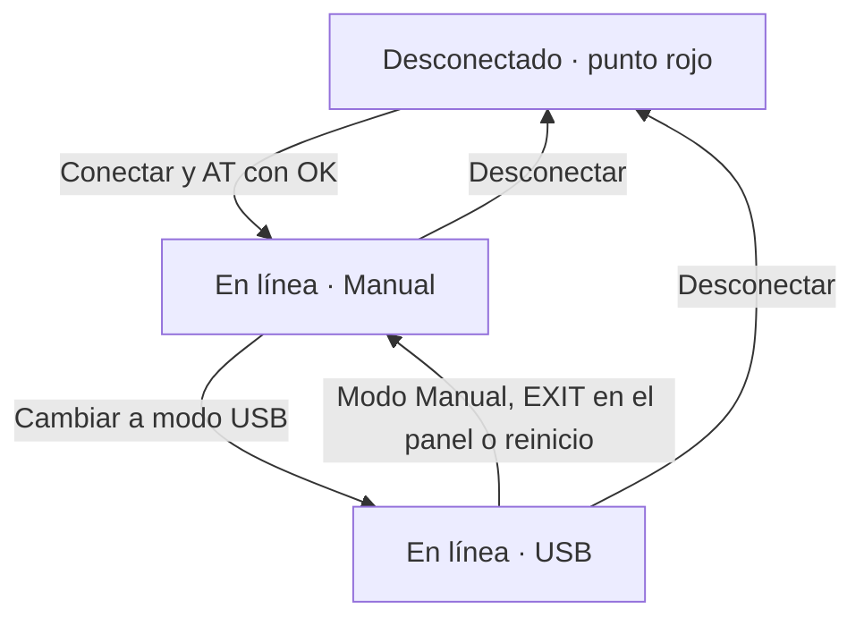
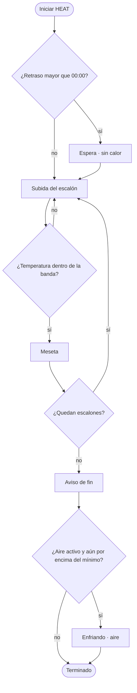

# Diseño de HotPlate Studio

Esta carpeta es la referencia visual de HotPlate Studio, la app de la carpeta de arriba ([`hotplate-studio/`](../)). El código sigue estas pantallas.

El detalle del cable (órdenes AT y tramas) está en [usb-automation.md](../../firmware/avr/doc/usb-automation.md). El orden del ciclo de soldadura, en [program_flows.md](../../firmware/avr/doc/program_flows.md).

## Qué hay en cada carpeta

| Carpeta | Qué es |
|---------|--------|
| [`stitch/`](stitch/README.md) | El diseño vigente. Cada pantalla tiene un PNG (cómo se ve) y un HTML (textos, jerarquía y colores) |
| `previews/` | Capturas de la app real con datos de demostración. Las usa la landing |
| `tools/` | `capture_previews.py` regenera `previews/`. `compare_stitch.py` pone la app al lado del PNG de Stitch |

Las capturas salen de la app de verdad: se abre en una ventana de 1280 px, se simula un equipo en modo USB y se guarda cada página completa. No toca tus `ramps.json`, `tune_params.json` ni `ui_theme.json`. Las curvas vienen de un modelo térmico sencillo (`tools/demo_data.py`), no de un equipo.



Regenerar las capturas y pasarlas a la landing (desde la raíz del repo):

```bash
.venv/bin/python hotplate-studio/design/tools/capture_previews.py
cd landing-page && ../.venv/bin/python resources/prepare_media.py studio-
```

| Captura | Estado que muestra |
|---------|--------------------|
| `01_conexion.png` | En línea, modo USB, consola con el saludo y la lectura de ajustes |
| `02_heat_en_curso.png` | HEAT en la meseta de la rampa 4 |
| `03_heat_terminado.png` | HEAT terminado con el aviso de fin (`ALARM:2`) |
| `04_heat_falla.png` | Corte por falla de sensor (`FL=1`) en la subida de la rampa 2 |
| `05_autotune_listo.png` | Autoajuste terminado, 5 de 5 ciclos |
| `06_ajustes.png` | Ajustes leídos del equipo |
| `07_apariencia.png` | Apariencia · Fuentes |

## Las cinco pantallas

La cabecera no cambia de página. La barra de abajo tampoco: un punto de color, el puerto y el modo.



| Pantalla | Qué resuelve |
|----------|----------------|
| Conexión | Abrir el puerto, pasar a USB y ver el tráfico |
| HEAT | Editar el perfil, lanzar el ciclo y ver la curva |
| Autotune | Hacer el ensayo y leer Kp y Ki |
| Ajustes | Límites, bandas de meseta, retraso, aire y ganancias. Se guardan en el equipo |
| Apariencia | Fuentes y colores. Solo en este computador |

HEAT y Autotune usan el mismo panel de estado y la misma curva. Cambian el formulario de arriba y el título de la gráfica.

## Tomar el control



En USB el panel del equipo solo muestra la temperatura, la palabra USB y un botón EXIT. Sin ese modo el equipo rechaza arrancar, parar o guardar (`ERROR:3`).

Al pasar a USB la app lee el perfil y los ajustes, y deja de preguntar el estado: el equipo lo envía solo, una vez por segundo.

## Un ciclo HEAT

El perfil tiene de 1 a 4 escalones seguidos, desde la rampa 1. Cada uno sube hasta su temperatura y luego sostiene la meseta. La temperatura no puede bajar de un escalón al siguiente. El retraso, si no es `00:00`, cuenta atrás sin calor.



Parar el ciclo en espera, subida o meseta no corta en seco: el equipo lo trata como fin y sigue por el aviso y el enfriamiento. Un fallo de sensor, una sobretemperatura o una consigna que no se alcanza cortan la salida y la pantalla lo marca como falla.

El autoajuste es otro ensayo: oscila alrededor de una consigna, calcula Kp y Ki, y solo los guarda si termina bien.

## Decisiones que la interfaz respeta

- El idioma de la interfaz es español. Temperaturas en °C, mesetas en segundos, el retraso como reloj `hh:mm` (de `00:00` a `12:00`).
- La consigna no pasa de 250 °C ni de la temperatura máxima del equipo. La máxima puede llegar a 260 °C.
- La apariencia no se envía al HotPlate. El perfil, los límites y las ganancias sí.
- La ventana se abre maximizada y no se puede dejar por debajo de 1100×760.

## Colores de base

| Uso | Color |
|-----|--------|
| Fondo | `#f4f6f8` |
| Tarjeta | `#ffffff` |
| Texto | `#2c3e50` |
| Texto secundario | `#5d6d7e` |
| Acento y botones principales | `#1a5276` |
| Temperatura medida | `#c0392b` |
| Consigna | `#2980b9` |
| Potencia | `#27ae60` |

La lista de pantallas, con su PNG y el archivo de código que la implementa, está en [stitch/README.md](stitch/README.md).
